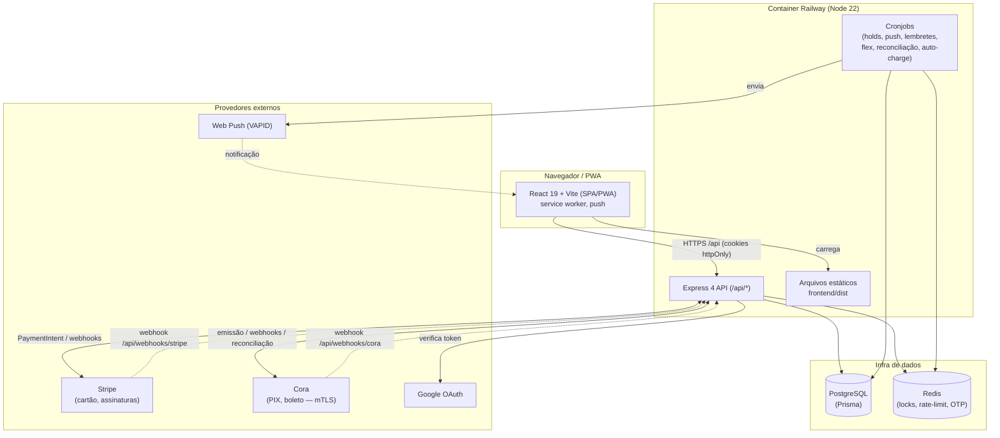

# Arquitetura

## Visão geral

O sistema é um **monorepo** com dois workspaces npm:

- **`frontend/`** — SPA em React 19 + Vite 6, empacotada como **PWA** (instalável, com service worker e push). Em produção é servida como arquivos estáticos pelo próprio backend.
- **`backend/`** — API REST em Express 4 + TypeScript (ESM), com Prisma 7 sobre PostgreSQL e Redis para locks/rate-limit/OTP. Integra-se à **Stripe** (cartão) e à **Cora** (PIX/boleto).

Em produção (Railway), um **único container** roda o backend, que também serve o build estático do frontend e faz o fallback de rotas do React Router para `index.html`.

## Diagrama de contexto



## Camadas do backend

```
backend/src/
├── index.ts            # boot do Express: middleware, rotas, registro dos cronjobs
├── config/             # configuração tipada (lê variáveis de ambiente)
├── middleware/         # auth (JWT), authorize (papéis), errorHandler
├── modules/            # features (cada uma com routes.ts + sub-arquivos)
│   ├── auth/  bookings/  contracts/  payments/  pricing/  stripe/
│   ├── webhooks/  notifications/  reports/  finance/  users/
│   ├── integrations/  blocked-slots/  push/
├── lib/                # serviços de domínio (pagamentos, Cora, Stripe, OTP, flexCredits, etc.)
├── jobs/               # cronjobs (executados via setInterval no boot)
├── generated/prisma/   # cliente Prisma gerado (versionado)
├── scripts/            # utilitários (seedBusinessConfig, cleanupTestData)
└── utils/              # helpers (crypto, pricing)
```

Cada **módulo** expõe um `router` do Express montado sob um prefixo em `index.ts` (ex.: `/api/contracts`). Módulos maiores (bookings, contracts, pricing, payments, users, integrations) dividem os handlers em vários arquivos que compartilham o mesmo `router` (ex.: `contract.creation.ts`, `contract.lifecycle.ts`, `contract.payments.ts`).

A camada **`lib/`** concentra a lógica de negócio reutilizável. Destaque para `paymentEffects.ts`, a **fonte única de verdade** dos efeitos colaterais de um pagamento confirmado (ativar contrato, confirmar booking, liberar serviços, gerar notificações) — chamada tanto pelos webhooks quanto pela reconciliação. Veja [pagamentos.md](pagamentos.md).

## Camadas do frontend

```
frontend/src/
├── App.tsx             # rotas + guards (ProtectedRoute/AdminRoute) + layout
├── pages/              # uma página por rota (lazy-loaded)
├── components/         # componentes e modais reutilizáveis
├── context/            # AuthContext, UIContext, NavigationContext
├── hooks/              # useServiceWorker, usePushSubscription, useBusinessConfig, ...
├── api/                # client HTTP (fetch com cookies + refresh automático)
├── constants/          # platforms, paymentMethods
├── styles/             # CSS
└── sw.ts               # service worker (Workbox via injectManifest)
```

As rotas e a divisão cliente/admin estão em [`frontend/src/App.tsx`](../../frontend/src/App.tsx). Páginas são **lazy-loaded** e pré-carregadas em idle após o login. Os guards:

- `ProtectedRoute` — exige usuário autenticado; envolve a página no `Layout`.
- `AdminRoute` — exige `role === 'ADMIN'`; senão redireciona para `/dashboard`.

## Fluxo de uma requisição

1. O frontend chama `/api/...` com **cookies httpOnly** (credenciais incluídas).
2. `helmet` (CSP em produção) e `cors` (origens permitidas) processam a requisição.
3. **Rate limiters** específicos (auth, otp, pagamentos, refresh) e o limitador geral `/api` (Redis) são aplicados.
4. O middleware `authenticate` valida o `accessToken`; `authorize('ADMIN')` checa o papel quando necessário.
5. O handler do módulo executa a lógica (Prisma + Redis + provedores) e responde JSON.
6. Erros caem no `errorHandler` central.

## Decisões de arquitetura

- **Container único** servindo API + estáticos: simplifica deploy e CORS (mesma origem em produção). O fallback `app.get('*')` entrega o `index.html` para o React Router.
- **Redis como dependência forte**: além de cache, é usado para **locks distribuídos** (evitar booking duplicado e execução duplicada de cronjobs em múltiplas instâncias), **rate limiting global** e **OTP**.
- **Cliente Prisma versionado** (`generated/prisma`): garante build reprodutível no monorepo/Windows e no Docker. Detalhes e o gotcha de regeneração em [modelo-de-dados.md](modelo-de-dados.md).
- **Efeitos de pagamento centralizados** em `paymentEffects.ts`: webhook e reconciliação convergem para o mesmo código, evitando divergência de estado.

## Relacionado

- [Setup de desenvolvimento](setup-dev.md) · [Modelo de dados](modelo-de-dados.md) · [API](api.md) · [Deploy](deploy.md)
