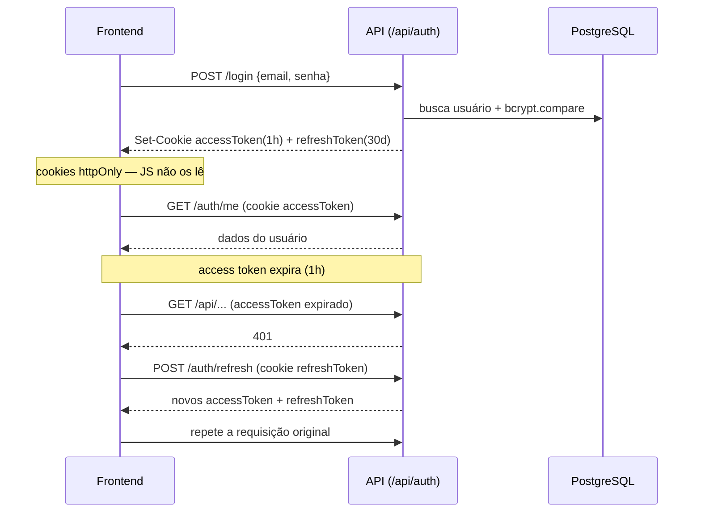

# Autenticação

Autenticação por **JWT em cookies httpOnly**, com refresh automático. Implementação em [`backend/src/modules/auth/routes.ts`](../../backend/src/modules/auth/routes.ts) e no middleware [`backend/src/middleware/auth.ts`](../../backend/src/middleware/auth.ts).

## Tokens

| Token | Validade (default) | Cookie | Observações |
| --- | --- | --- | --- |
| `accessToken` | `1h` (`JWT_ACCESS_EXPIRY`) | httpOnly, `SameSite=Lax`, `Secure` em produção | usado em toda requisição autenticada |
| `refreshToken` | `30d` (`JWT_REFRESH_EXPIRY`) | httpOnly, **path restrito** a `/api/auth/refresh` | renova o access token |

Assinatura HS256 com `JWT_SECRET` / `JWT_REFRESH_SECRET` (obrigatórios em produção — o boot falha sem eles; em dev caem para `dev-secret`/`dev-refresh-secret` com aviso).

## Formas de entrar

1. **E-mail + senha** — `POST /api/auth/login` (bcrypt, custo 12).
2. **Cadastro com OTP** — `POST /api/auth/register/send-code` → `POST /api/auth/register` (valida o código). Também há `POST /api/auth/otp/send` e `/otp/verify`.
3. **Google OAuth** — `POST /api/auth/google` (verifica o ID token ou valida o access token). Por segurança, **não** há vínculo automático de uma conta Google a um e-mail já existente com senha (evita account takeover).

## Fluxo de sessão (login + refresh)

No frontend, o client HTTP ([`frontend/src/api/client.ts`](../../frontend/src/api/client.ts)) envia `credentials: 'include'`, e ao receber **401** tenta `/auth/refresh` uma vez antes de deslogar. Na inicialização, chama `/auth/me` para restaurar a sessão — por isso a sessão (e o PWA instalado) **persiste ~30 dias**.

## OTP

Implementado em [`backend/src/lib/otp.ts`](../../backend/src/lib/otp.ts), apoiado no Redis:

- Código de **6 dígitos**, expira em **5 minutos**.
- **Cooldown** de reenvio (anti-spam).
- **Lockout** após 5 tentativas erradas (~30 min). O contador de falhas **não** é zerado ao gerar um novo código (evita bypass).
- Em dev, `ALLOW_OTP_BYPASS=true` aceita o código `999999` (bloqueado em produção, com aviso no boot).

## Middleware

- `authenticate` — lê o `accessToken` do cookie, valida e injeta `req.user` (`userId`, `role`).
- `authorize('ADMIN')` — exige papel admin; usado nas rotas de operação/configuração.

No frontend, os guards `ProtectedRoute` e `AdminRoute` ([`frontend/src/App.tsx`](../../frontend/src/App.tsx)) protegem as rotas correspondentes.

## Rate limiting

Endpoints de auth têm limites dedicados (ver [api.md](api.md#rate-limits)): login/register 15/15min, refresh 60/15min, OTP 5/15min — todos via Redis (globais entre instâncias).

## Endurecimentos aplicados

- Sem auto-vínculo Google → e-mail existente (exige login com senha primeiro).
- bcrypt custo 12.
- Sanitização do `userId` no caminho de upload de foto (evita path traversal).
- OTP: contador de falhas preservado entre códigos; lockout temporário.
- Erros internos do Google auth não vazam para o cliente.

## Relacionado

- [API](api.md) · [Pagamentos](pagamentos.md)
