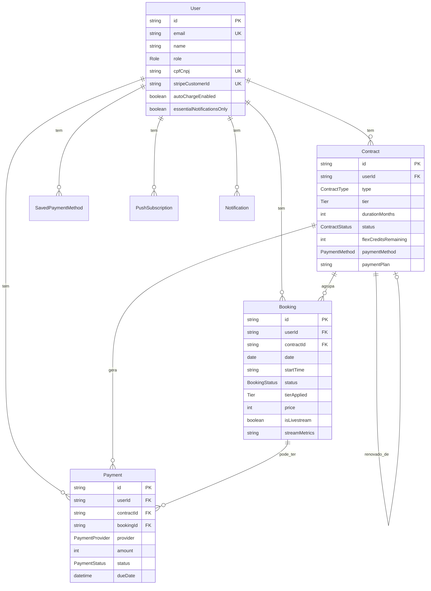
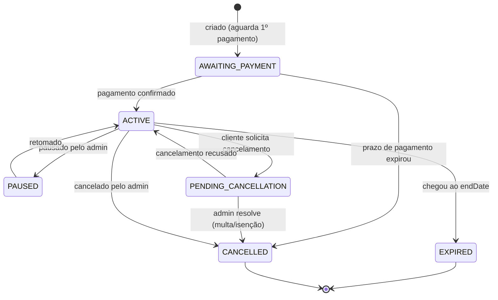
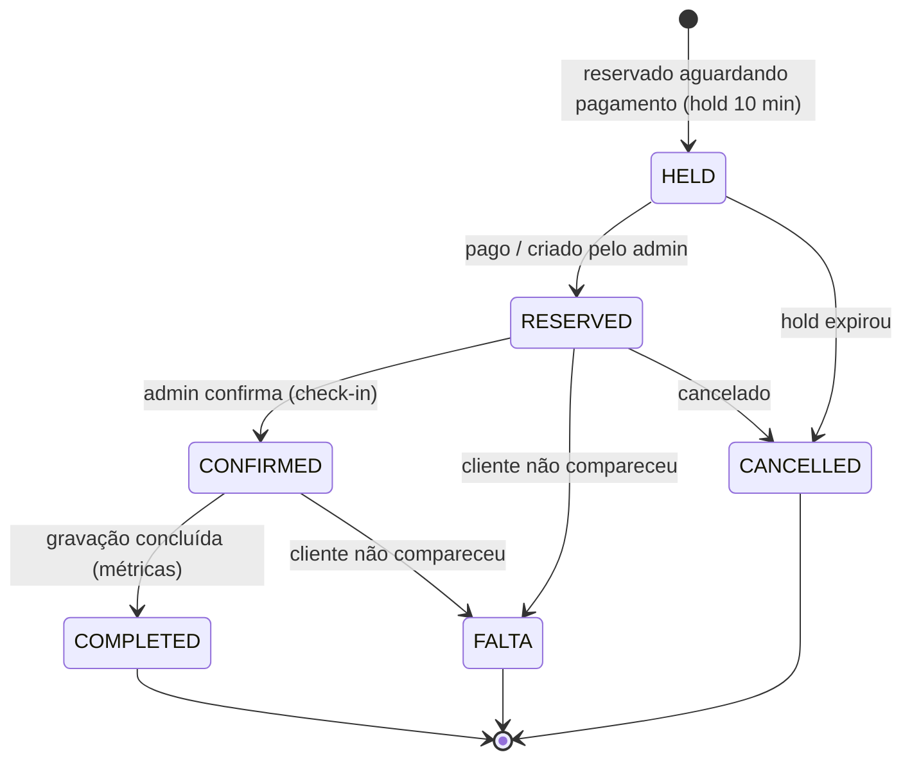

# Modelo de dados

Fonte de verdade: [`backend/prisma/schema.prisma`](../../backend/prisma/schema.prisma). Provider PostgreSQL; cliente gerado em `backend/src/generated/prisma` (versionado).

> **Dinheiro em centavos.** Todos os campos `Int` de valor (preço, amount) são em centavos: R$ 300,00 = `30000`.

## Diagrama ER (modelos centrais)

## Enums

| Enum | Valores |
| --- | --- |
| `Role` | `ADMIN`, `CLIENTE` |
| `ContractType` | `FIXO`, `FLEX`, `SERVICO`, `CUSTOM`, `AVULSO` |
| `Tier` | `COMERCIAL`, `AUDIENCIA`, `SABADO` |
| `BookingStatus` | `RESERVED`, `CONFIRMED`, `HELD`, `COMPLETED`, `FALTA`, `NAO_REALIZADO`, `CANCELLED` |
| `ContractStatus` | `ACTIVE`, `AWAITING_PAYMENT`, `EXPIRED`, `CANCELLED`, `PENDING_CANCELLATION`, `PAUSED` |
| `PaymentProvider` | `STRIPE`, `CORA` |
| `PaymentStatus` | `PENDING`, `PAID`, `FAILED`, `REFUNDED`, `CANCELLED` |
| `PaymentMethod` | `CARTAO`, `PIX`, `BOLETO` |
| `NotificationType` | `CONTRACT_EXPIRING`, `PAYMENT_OVERDUE`, `PAYMENT_CONFIRMED`, `PAYMENT_FAILED`, `BOOKING_UNCONFIRMED`, `BOOKING_REMINDER`, `BOOKING_CONFIRMED`, `BOOKING_CANCELLED`, `CONTRACT_ACTIVATED`, `CONTRACT_RENEWED`*, `CANCELLATION_PENDING`, `FLEX_CREDITS_LOW`, `CLIENT_INACTIVE`*, `CONTRACT_AWAITING_PAYMENT`, `SYSTEM`* |

> *`CONTRACT_RENEWED`, `CLIENT_INACTIVE` e `SYSTEM` foram **podados em jun/2026** — não são mais emitidos, mas seguem no enum para casar com o tipo no Postgres (remover exigiria migração com `--accept-data-loss`). Ver [notificacoes.md](notificacoes.md).

> `PaymentStatus.CANCELLED` ≠ `FAILED`: representa uma **parcela anulada** porque o contrato dela foi cancelado (não uma cobrança recusada).

## Modelos

### User (`users`)
Conta de cliente ou admin. Campos principais: `email`/`phone`/`googleId` (todos únicos e opcionais — login por e-mail, telefone ou Google), `passwordHash`, `role`, `cpfCnpj` (necessário para PIX), `address`/`city`/`state`, `tags[]`, `socialLinks` (JSON), `clientStatus` (`ACTIVE`/`INACTIVE`/`BLOCKED`), `stripeCustomerId`, `autoChargeEnabled` (cobrança automática no cartão), `essentialNotificationsOnly` (só notificações críticas), `notes` (observações internas do admin).

### Contract (`contracts`)
Plano contratado. Campos comuns: `name`, `type`, `tier`, `durationMonths` (3 ou 6), `discountPct` (30 ou 40), `startDate`/`endDate`, `status`, `addOns[]`, `paymentMethod`, `paymentPlan` (`MONTHLY` ou `FULL`), `boletoAllowed`.

- **FIXO:** `fixedDayOfWeek` (1=Seg…6=Sáb), `fixedTime` (`"14:00"`), `contractUrl`.
- **FLEX:** `flexCreditsTotal` (12 ou 24), `flexCreditsRemaining`, `flexCycleStart`, `flexWeeksCompensated` (adiantamento), `flexCreditsForfeited` (perdidos por atraso, monotônico), `flexForfeitFloor` (baseline para não punir retroativamente).
- **CUSTOM ("Monte Seu Plano"):** `customSchedule` (JSON de dias/horários), `sessionsPerWeek`/`sessionsPerCycle`/`totalSessions`, `addonCredits` (JSON), `accessMode` (`FULL`/`PROGRESSIVE`), `customCreditsRemaining`.
- **Pausa/renovação:** `pausedAt`, `pauseReason`, `resumeDate`, `paymentDeadline`, `renewedFromId` (auto-relação para o contrato anterior).

Índices: `userId`, `endDate`.

### Booking (`bookings`)
Sessão de gravação. `date` (DATE), `startTime`/`endTime`, `status`, `tierApplied`, `price`, `adminNotes`/`clientNotes`, `originalDate` (âncora da janela de 7 dias para remarcação), `platforms`/`platformLinks` (JSON), `addOns[]`, `holdExpiresAt` (auto-cancelamento da reserva).

Métricas de transmissão (Fase 2): `durationMinutes`, `peakViewers`, `chatMessages`, `audienceOrigin`, `isLivestream`, `streamMetrics` (JSON por rede: `{"YOUTUBE":{"views","peak","likes","comments"},...}`; `peakViewers`/`chatMessages` são agregados derivados).

Índices: `(date, startTime, status)`, `userId`, `contractId`, `date`, `status`.

### Payment (`payments`)
Cobrança. `provider` (`STRIPE`/`CORA`), `providerRef` (id da transação no gateway), `amount`, `status`, `dueDate`, `pixString`/`boletoUrl`/`paymentUrl`, `installments`, `paymentType` (`DEBIT`/`CREDIT`), `stripeSubscriptionId`, `metadata` (JSON — guarda dados do contrato pendente, add-ons, etc.), `paidAt`. Relaciona-se a `user` e, opcionalmente, a `contract` e `booking`.

Índices: `userId`, `contractId`, `bookingId`, `providerRef`, `status`, `stripeSubscriptionId`, `dueDate`.

### Configuração e apoio
- **SavedPaymentMethod (`saved_payment_methods`):** cartões salvos na Stripe (`stripePaymentMethodId`, `brand`, `last4`, `expMonth/Year`, `isDefault`).
- **BlockedSlot (`blocked_slots`):** horários bloqueados pelo admin (`date`, `startTime`, `endTime`, `reason`).
- **PricingConfig (`pricing_config`):** preço por `tier` (chave única), `label`, `description`.
- **AddOnConfig (`addon_config`):** serviços extras por `key` (`CORTES_IA`, `YOUTUBE_SEO`, ...), `price`, `monthly` (mensal vs. por gravação).
- **BusinessConfig (`business_config`):** parâmetros do negócio por `key` (`value`/`type`/`label`/`group`: `plans`/`policies`/`payments`).
- **PaymentMethodConfig (`payment_method_config`):** habilita/estiliza métodos (`PIX`/`CARTAO`/`BOLETO`), `active`, `sortOrder`, `accessMode`, `contexts` (CSV: `avulso,contract,invoice`).
- **IntegrationConfig (`integration_configs`):** credenciais (criptografadas) de `CORA`/`STRIPE`, `environment` (sandbox/production), `enabled`, status do último teste.
- **Notification (`notifications`):** `type`, `severity` (`critical`/`warning`/`info`), `title`/`message`, `entityType`/`entityId`, `actionUrl`, `read`, `pushSent`.
- **PushSubscription (`push_subscriptions`):** inscrição Web Push (`endpoint` único, `p256dh`, `auth`).
- **AuditLog (`audit_logs`):** trilha de auditoria (`entityType`, `entityId`, `action`, `changes` JSON, `performedBy`).

## Ciclo de vida do contrato

## Ciclo de vida do agendamento

## Migrations e cliente gerado

- Migrations: `backend/prisma/migrations/`. Em dev: `npm run db:migrate` (`prisma migrate dev`). Em produção: `prisma migrate deploy` roda no start do container (ver [deploy.md](deploy.md)).
- Após mudar o `schema.prisma`, **regenere** o cliente: `npm run db:generate -w backend`. No Windows/monorepo, use `cd backend && node ../node_modules/prisma/build/index.js generate` (ver [setup-dev.md](setup-dev.md)).
- O cliente em `backend/src/generated/prisma` é **versionado** para builds reprodutíveis (Docker copia-o do estágio de build).

## Relacionado

- [API](api.md) · [Pagamentos](pagamentos.md) · [Notificações](notificacoes.md)
