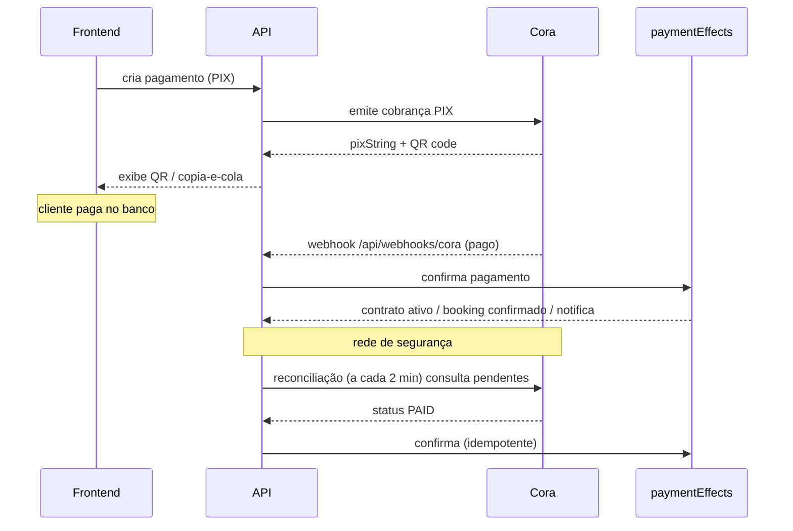
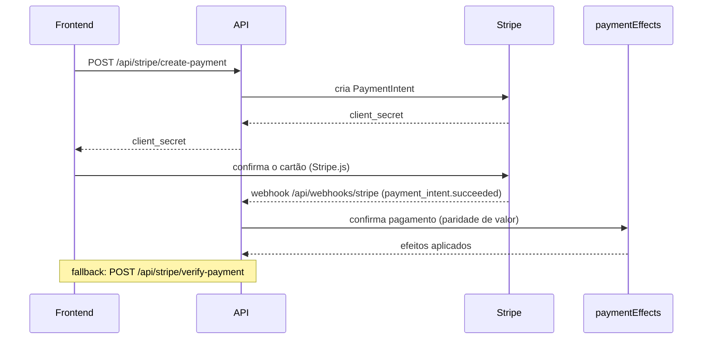

# Pagamentos

Dois provedores, roteados por método:

- **Stripe** — cartão de crédito (à vista e parcelado), salvar cartão, cobrança automática (off-session), assinaturas.
- **Cora** — **PIX** e **boleto** (API bancária via mTLS).

Arquivos-chave em [`backend/src/lib/`](../../backend/src/lib/): `paymentGateway.ts` (roteamento), `stripeService.ts`, `coraService.ts`, `coraPaymentHelper.ts`, `coraReconciliation.ts` e, sobretudo, **`paymentEffects.ts`**.

## paymentEffects — fonte única de verdade

Quando um pagamento é confirmado (por **webhook** ou por **reconciliação**), todo o efeito colateral passa por `paymentEffects.ts`. Isso garante que webhook e reconciliação produzam exatamente o mesmo estado. Efeitos típicos:

- marcar o `Payment` como `PAID` (com checagem de **paridade de valor**);
- **ativar o contrato** (`AWAITING_PAYMENT` → `ACTIVE`) e gerar os bookings (FIXO) / liberar créditos (FLEX);
- **confirmar o booking** correspondente (avulso);
- **liberar serviços** (add-ons) contratados;
- disparar **notificações** (ex.: `PAYMENT_CONFIRMED`, `CONTRACT_ACTIVATED`).

## Fluxo PIX (Cora)

Se o webhook não chegar, o job de **reconciliação** (a cada 2 min, ver [jobs-e-crons.md](jobs-e-crons.md)) consulta a Cora e converge para o mesmo `paymentEffects`.

## Fluxo cartão (Stripe)

O webhook da Stripe exige o **corpo bruto** para verificar a assinatura — por isso `index.ts` registra `express.raw` em `/api/webhooks/stripe` antes do `express.json`. Há também `POST /api/stripe/verify-payment` como recuperação manual (verifica o PaymentIntent e confirma, checando a posse via `metadata.paymentId`).

## Parcelamento

A política de parcelas (máximo e parcelas sem juros) é calculada no backend conforme tipo/duração do contrato e devolvida por `POST /api/stripe/installment-plans` e `POST /api/pricing/checkout-quote`. **A cotação autoritativa vem sempre do servidor** — o frontend nunca decide o valor final.

Planos de pagamento de contrato:
- **MENSAL** — paga a 1ª parcela agora; as demais vencem mês a mês (e podem ser cobradas no cartão via `autoChargeJob` ou pagas manualmente).
- **À VISTA (FULL)** — paga tudo de uma vez (com desconto, quando aplicável).

## Métodos por contexto

`PaymentMethodConfig.contexts` (CSV `avulso,contract,invoice`) controla onde cada método aparece. O **boleto** é desligado por padrão e pode ser liberado por contrato (`Contract.boletoAllowed`).

## Modo sandbox e simulação

- `GET /api/payments/sandbox-mode` informa se o gateway está em sandbox.
- `POST /api/payments/:id/simulate` confirma um pagamento **sem cobrança real** (apenas sandbox/dev) — usado nos testes E2E (o modal de PIX mostra o botão "Simular pagamento PIX").

## Segurança (resumo)

- **Paridade de valor** antes de marcar `PAID` (valor do PI/cobrança == valor no banco).
- Webhooks **sem assinatura** são rejeitados em produção (`ALLOW_UNVERIFIED_WEBHOOKS` só vale em dev).
- Transições atômicas (ex.: só `PENDING→PAID`, `PAID→REFUNDED`).
- Endpoints financeiros com rate limit dedicado (ver [api.md](api.md#rate-limits)).
- Credenciais de integração **criptografadas** (AES) em `IntegrationConfig`.

## Relacionado

- [Jobs e crons](jobs-e-crons.md) · [Modelo de dados](modelo-de-dados.md) · [API](api.md) · Guia do admin: [Financeiro](../guia-admin/financeiro.md)
