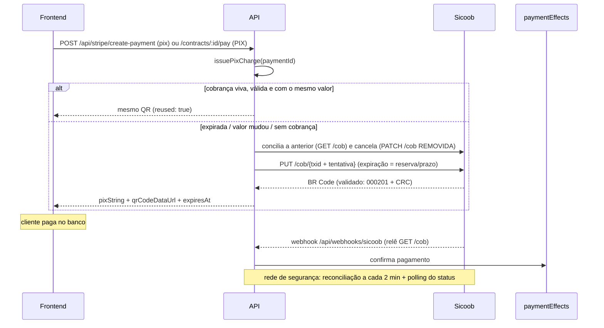
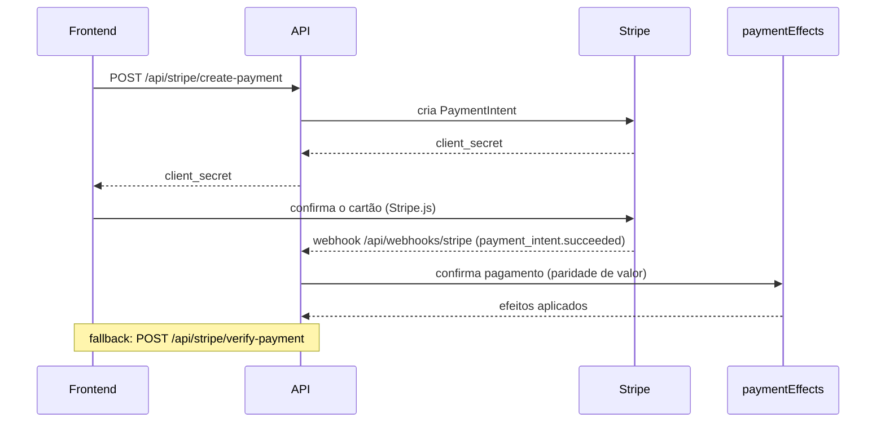

# Pagamentos

Provedores, roteados por método:

- **Stripe** — cartão de crédito (1× na conta BR atual; parcelado só numa conta que parcela — ver [Parcelamento](#parcelamento)), salvar cartão, cobrança automática (off-session), assinaturas.
- **Sicoob** — **PIX** (API Pix Bacen: `/cob`, txid). É o provedor de PIX preferido.
- **Cora** — **boleto** (e PIX, se o Sicoob estiver desligado). API bancária via mTLS.

Arquivos-chave em [`backend/src/lib/`](../../backend/src/lib/): `paymentGateway.ts` (roteamento), `pixGateway.ts` (PIX: `issuePixCharge`), `sicoobService.ts`, `sicoobReconciliation.ts`, `brcode.ts`, `stripeService.ts`, `coraService.ts`, `coraPaymentHelper.ts`, `coraReconciliation.ts` e, sobretudo, **`paymentEffects.ts`**.

## paymentEffects — fonte única de verdade

Quando um pagamento é confirmado (por **webhook** ou por **reconciliação**), todo o efeito colateral passa por `paymentEffects.ts`. Isso garante que webhook e reconciliação produzam exatamente o mesmo estado. Efeitos típicos:

- marcar o `Payment` como `PAID` (com checagem de **paridade de valor**);
- **ativar o contrato** (`AWAITING_PAYMENT` → `ACTIVE`, via `activateAwaitingContract`) e gerar os bookings (FIXO) / liberar créditos (FLEX);
- **renovação paga** (`generateBookingsForRenewedContract`, FIXO e personalizado): cada ocorrência é trancada com `createSlotClaimer` (a mesma trava Redis do avulso/`/custom`) e conferida no banco; **horário ocupado é pulado** (nunca sobrepõe). Personalizado usa `planCustomOccurrences` (semana a semana, volume = `sessionsPerCycle × meses`, o que a parcela cobra) e cada sessão pulada vira **crédito** (`customCreditsRemaining`) para o cliente agendar; FIXO pulado segue disponível pelo teto do plano. Grava sob `SELECT … FOR UPDATE` no contrato e com mutex Redis por contrato (duas confirmações não geram em dobro); Redis fora → confere só no banco. Contrato cancelado, em cancelamento, pausado ou expirado **nunca** gera (a função roda a cada pagamento confirmado com `contractId` — ex.: multa paga de um contrato cancelado antes da 1ª sessão);
- **promover as sessões reservadas** na ativação (D9, personalizado do cliente): `accessMode` FULL → todas as `RESERVED/HELD` viram `CONFIRMED`; PROGRESSIVE → só o 1º ciclo (as demais ficam `RESERVED` sem timer e são liberadas uma parcela por vez por `unlockNextCycleBookings`; a parcela que ativa não libera um 2º ciclo);
- **confirmar o booking** correspondente (avulso);
- **liberar serviços** (add-ons) contratados;
- disparar **notificações** (ex.: `PAYMENT_CONFIRMED`, `CONTRACT_ACTIVATED`).

## Fluxo PIX (Sicoob; Cora como alternativa)

```mermaid
sequenceDiagram
    participant FE as Frontend
    participant API as API
    participant SC as Sicoob
    participant EF as paymentEffects

    FE->>API: POST /api/stripe/create-payment (pix) ou /contracts/:id/pay (PIX)
    API->>API: issuePixCharge(paymentId)
    alt cobrança viva, válida e com o mesmo valor
        API-->>FE: mesmo QR (reused: true)
    else expirada / valor mudou / sem cobrança
        API->>SC: concilia a anterior (GET /cob) e cancela (PATCH /cob REMOVIDA)
        API->>SC: PUT /cob/{txid + tentativa} (expiração = reserva/prazo)
        SC-->>API: BR Code (validado: 000201 + CRC)
        API-->>FE: pixString + qrCodeDataUrl + expiresAt
    end
    Note over FE: cliente paga no banco
    SC-->>API: webhook /api/webhooks/sicoob (relê GET /cob)
    API->>EF: confirma pagamento
    Note over API,SC: rede de segurança: reconciliação a cada 2 min + polling do status
```

**`issuePixCharge(paymentId)`** (`lib/pixGateway.ts`) é a fonte ÚNICA de QR sob demanda (D15):

- **Reuso** só se a cobrança estiver viva (`Payment.pixExpiresAt` com ≥ 60 s de folga), for um BR Code válido e tiver sido emitida para o **mesmo valor** do Payment (`metadata.pixCharge.amount`). Linhas antigas sem `pixExpiresAt` nunca são reusadas.
- **Senão**: concilia a cobrança anterior (se já foi paga → `alreadyPaid`, nada é emitido), cancela-a no provedor (best-effort) e emite uma nova. O **txid** da 1ª emissão é o id do Payment sem hífens (compatível com o legado); da 2ª em diante leva o nº da tentativa em base36 (`metadata.pixCharge.attempt`). Na Cora a `Idempotency-Key` também ganha a tentativa.
- **Validade**: avulso em espera → até o fim da reserva (10 min, piso 120 s); contrato `AWAITING_PAYMENT` → `min(1 h, prazo restante)` (serviço = 10 min); demais (parcelas) → 1 h.
- Grava `provider`, `providerRef`, `pixString`, `pixExpiresAt` e `metadata.pixCharge` num único `updateMany` guardado por `PENDING`, e devolve `{ provider, providerRef, pixString, qrCodeDataUrl, expiresAt, amount, reused, alreadyPaid }`.
- **Troca de método**: ir para o cartão aposenta o PIX vivo (concilia + cancela) e limpa `pixString/pixExpiresAt`; um PaymentIntent de cartão `succeeded/processing` impede emitir PIX por cima. O reset de um Payment `FAILED` limpa `pixExpiresAt` e preserva o contador de tentativas.
- **Parcelas 2..N por PIX não são pré-geradas** (fulfillment do `/self`, do serviço e o `/custom`): o QR sai no clique em "Pagar". Boleto continua pré-gerado.
- **Mudança de valor** (`applyContractServiceChange`): as parcelas PENDING com PIX emitido para o valor antigo são conciliadas, a cobrança é cancelada e `pixString/providerRef/pixExpiresAt` são zerados.

**Validação do BR Code** (`lib/brcode.ts`: `crc16`, `isValidBrCode`, `buildStaticBrCode`): em **produção**, um EMV inválido do Sicoob vira erro (nunca se exibe um QR que o banco não lê). Em **sandbox/dev** (trava dupla: integração em sandbox **e** `NODE_ENV !== 'production'`), o texto aleatório do mock é trocado por um **BR Code sintético válido** com o valor, a chave e o txid (25 primeiros caracteres) reais — o banco lê e mostra o valor, mas a confirmação em sandbox é pelo "Simular pagamento". Sem nenhum provedor de PIX, `paymentGateway.createPayment` **falha em produção**; em dev devolve um BR Code válido com o valor real (antes era um EMV fixo de R$ 10 com CRC inválido).

**Conciliação Sicoob em sandbox**: o `GET /cob` do sandbox devolve status/criação aleatórios, então `reconcileSicoobCancellation` **não marca `FAILED`** em sandbox (antes derrubava o checkout ~2 min após gerar o QR). Em produção, só falha a cobrança ATUAL do Payment (o `providerRef` entra no `where`).

**Hardening** do `httpsCall` do Sicoob: erros/cortes no stream da **resposta** (`res.on('error' | 'aborted' | 'close')`) viram rejeição tratada em vez de exceção não tratada.

Se o webhook não chegar, o job de **reconciliação** (a cada 2 min, ver [jobs-e-crons.md](jobs-e-crons.md)) consulta o provedor e converge para o mesmo `paymentEffects`.

## Fluxo cartão (Stripe)

```mermaid
sequenceDiagram
    participant FE as Frontend
    participant API as API
    participant ST as Stripe
    participant EF as paymentEffects

    FE->>API: POST /api/stripe/create-payment
    API->>ST: cria PaymentIntent
    ST-->>API: client_secret
    API-->>FE: client_secret
    FE->>ST: confirma o cartão (Stripe.js)
    ST-->>API: webhook /api/webhooks/stripe (payment_intent.succeeded)
    API->>EF: confirma pagamento (paridade de valor)
    EF-->>API: efeitos aplicados
    Note over FE,API: fallback: POST /api/stripe/verify-payment
```

O webhook da Stripe exige o **corpo bruto** para verificar a assinatura — por isso `index.ts` registra `express.raw` em `/api/webhooks/stripe` antes do `express.json`. Há também `POST /api/stripe/verify-payment` como recuperação manual (verifica o PaymentIntent e confirma, checando a posse via `metadata.paymentId`).

## Parcelamento

A política de parcelas (máximo e parcelas sem juros) é calculada no backend (`getInstallmentPolicy` em `lib/paymentPolicy.ts`) conforme tipo/duração do contrato e devolvida por `POST /api/stripe/installment-plans` e `POST /api/pricing/checkout-quote`. **A cotação autoritativa vem sempre do servidor** — o frontend nunca decide o valor final.

Planos de pagamento de contrato:
- **MENSAL** — paga a 1ª parcela agora; as demais vencem mês a mês (e podem ser cobradas no cartão via `autoChargeJob` ou pagas manualmente). Cada mensalidade é 1×.
- **À VISTA (FULL)** — paga tudo de uma vez (desconto PIX quando aplicável); cartão 1–12×, sem juros até a duração, com juros acima. Avulso: 1–12×, sem juros só em 1×. **N× (N > 1) só quando o gateway parcela** (ver abaixo) — na conta Stripe BR atual, tudo é 1×.

**Desconto PIX só no PIX (D1)** — o `amount` de uma cobrança à vista criada com PIX já embute o desconto PIX; pago no **cartão**, cobra-se o valor SEM o desconto (`cardChargeBaseAmount` em `pixGateway.ts`, usado por `create-payment`, `installment-plans`, `/contracts/:id/pay` e `autoChargeJob`; o valor do PI vai em `chargedAmount`, `amount` fica intacto):
- **Regra única: a marca da criação** — TODA cobrança criada com desconto PIX grava `metadata.pixDiscount = { pct, cardAmount, pixAmount }` (`pixDiscountMetaForCharge`, preservando o resto do metadata): FULL + PIX do admin (`POST /contracts`), do `/self` (junto do `contractData`), do `/custom` (semanal e datas livres), do serviço (`/contracts/service`), do `/pay` do serviço à vista (renovação) e o repreço de `applyContractServiceChange`. `cardAmount` = o **valor base** do cartão calculado na criação (total sem o desconto PIX, com o mesmo cupom em R$); `pixAmount` = o `amount` gravado. O cartão cobra exatamente `cardAmount` — mudar `pix_extra_discount_pct` depois não altera nada. Se o `amount` mudar sem a marca ser regravada (`pixAmount` ≠ `amount`), a marca caduca e o cartão cobra o `amount`.
- **Sem a marca → o próprio `amount`**, sempre. `cardChargeBaseAmount` decide só pela linha que recebe: não lê o banco nem olha contrato, forma de pagamento, data de criação, provider ou o % configurado hoje. Não há fallback legado, corte por data nem congelamento de valores. Extras de sessão (`bookingId`), multa de cancelamento e qualquer outra cobrança sem a marca **nunca** são inflados.
- **Valor zero nunca vai ao cartão** — cobrança de R$ 0 (cupom 100% ou cupom VALOR ≥ total) não recebe a marca (`buildPixDiscountMeta` / `pixDiscountMetaForCharge` devolvem `undefined` com `pixAmount` ≤ 0), e `cardChargeBaseAmount` devolve 0 mesmo numa linha que tenha marca (`installment-plans` responde 400 "Valor inválido."). No `POST /contracts` do admin, as parcelas de R$ 0 nascem `PAID`; a 1ª passa por `onPaymentConfirmed` (uso do cupom `CONFIRMED` e demais efeitos de confirmação), como já faziam o `/self` e o `/custom`. Nada vai ao gateway nem ao `autoChargeJob`.
- **Troca da forma de pagamento pelo admin** (`PATCH /contracts/:id` `paymentMethod`) — os **valores não mudam** e nenhuma cobrança é regravada (nem marca, nem `amount`, nem provider). PIX→CARTÃO: o `amount` continua o do PIX e o cartão cobra a base marcada (sem o desconto); CARTÃO/BOLETO→PIX: a cobrança continua com o valor cheio (o desconto PIX não é aplicado retroativamente) e o cartão cobra o próprio `amount`. Para dar o desconto PIX a uma cobrança já criada no cartão, é preciso recriá-la.
- **Cobranças antigas (sem a marca) — decisão conservadora** — as cobranças à vista criadas com desconto PIX antes de a marca existir não têm `metadata.pixDiscount`. Pagas no cartão, saem pelo `amount` gravado (o preço PIX), ou seja, **abaixo** do preço de cartão, **nunca acima**. O fallback que revertia o % configurado foi removido na revisão final (24/09/2026) porque adivinhava pelo estado atual e cobrava **a mais**: cupom 100% cobrando R$ 252, linha criada no cartão com o contrato trocado para PIX cobrando +11%, % alterado depois da criação. Para cobrar o preço de cartão numa cobrança antiga, recrie-a (a nova nasce marcada). As parcelas de R$ 0 criadas pelo admin antes desta correção podem ter ficado `PENDING`. O cartão nunca cobra nada nelas (a base é 0), mas o `autoChargeJob` e o `create-payment` não pulam valor 0: o Stripe recusa a cobrança, e o cliente pode receber um aviso de falha. Convém confirmá-las como pagas.
- O checkout mostra no cartão o valor do plano 1× de `/stripe/installment-plans` (= o que o servidor cobra) e avisa "O desconto à vista vale só no PIX" só quando os valores diferem.
- **PaymentIntent anterior** (`settleExistingCardIntent`, em `create-payment` e no cartão do `/contracts/:id/pay`): antes de criar um PI novo para a cobrança, o anterior (`providerRef` pi_…, inclusive o de uma linha `FAILED` reaberta) é conferido — `succeeded`/`processing`/`requires_capture` → 409 `CARD_PAYMENT_IN_FLIGHT` e nenhum PI novo; pagável com **outro valor** → cancelado antes (senão, pago numa aba aberta, viraria dinheiro sem registro: o webhook recusa valor divergente); falha ao consultar/cancelar → 503.

**Relatórios** — o fechamento (`GET /api/finance/closing/:ano/:mes`) e o resumo `GET /api/payments/summary` somam como bruto de um pagamento PAGO o valor **efetivamente cobrado** (`paidChargedAmount`: `chargedAmount` quando a cobrança paga foi a do cartão — provider STRIPE ou ref `pi_…`; senão `amount`), e, no fechamento, a taxa versionada do gateway incide sobre esse valor (`amount` na resposta = esse bruto; a base gravada vai em `baseAmount`). O mesmo critério vale para o "pago" de `GET /api/users` (`totalPaid`), da prévia de exclusão (`preserved.paidAmount`), do detalhe do contrato no admin (Valor do contrato / Pago), de Meus Pagamentos (total pago e histórico) e da saúde do cliente (`utils/clientHealth.paidChargedAmount` no front); pendente continua pelo `amount`. A **multa de cancelamento** é a exceção: `cancellation_fine_pct`% da soma do `amount` das cobranças pagas (o valor contratado, sem juros nem a diferença do desconto PIX no cartão) — e o `CancelContractModal` mostra essa mesma conta. O `POST /stripe/create-payment` no cartão devolve `amount` (= `chargedAmount`, o valor do PaymentIntent) e `installments`; o checkout exibe esse valor no formulário do cartão novo.

**Serviço (SERVICO, D1)** — `POST /api/contracts/service` grava o teto em `Payment.metadata.installmentCap`, que a política lê (só para SERVICO; pagamentos antigos sem teto seguem a regra acima):
- **Mensal + PIX** (ou cartão sem `cardSplit`) → 1ª mensalidade agora, demais mês a mês.
- **Mensal + Cartão com `cardSplit: true`** → o **total** agora (plano gravado `FULL`, sem desconto PIX) em **até N× sem juros**, N = meses da fidelidade (`installmentCap = N`). O wizard só oferece essa opção quando o gateway parcela (`POST /stripe/installment-plans { amount, contractDurationMonths: N, installmentCap: N }` devolve mais que `[1x]`); na conta BR fica só "mês a mês".
- **À vista** → pagamento **único** (`installmentCap = 1`): PIX com desconto PIX ou cartão 1×. Não há mais 4×–12× com juros para serviço.
- Prazo de pagamento: **10 min** (`config.studio.lockTtlSeconds`); o QR PIX expira junto. Uma nova contratação do mesmo serviço substitui a anterior ainda não paga (mesma rotina segura da varredura).

**O nº de parcelas chega ao Stripe?** A conta Stripe é **BR** e o Stripe **não oferece parcelamento no Brasil** (verificado no modo teste: `available_plans` sempre vazio; plano recusado na confirmação, inclusive via ConfirmationToken). Regra no servidor (`stripeService.ts`):
- `stripeCardInstallmentsSupported()` lê o país da conta (cache de 6 h; falha → `false`; só MX/JP parcelam). `cardInstallmentsBlockReason()` libera N× (N > 1) **só com cartão SALVO numa conta que parcela**, confirmado no servidor com `payment_method_options.card.installments.plan` conferido em `available_plans` (se o cartão não oferece N×, o PI é cancelado e o cliente recebe erro claro).
- **Cartão novo** com N > 1 → `POST /stripe/create-payment` responde **400 `INSTALLMENTS_UNAVAILABLE`** antes de qualquer efeito (reabrir FAILED, aposentar PIX, criar PI). O PI só habilita `installments` quando o servidor fixa o plano — o Payment Element nunca mostra o seletor de parcelas do Stripe.
- Conta sem parcelamento → `POST /stripe/installment-plans` e `POST /pricing/checkout-quote` devolvem **só 1x** (`maxInstallments`/`freeUpTo` = 1). As telas que prometiam "até N× sem juros" (serviço, contrato fixo/flex, personalizado, criação pelo admin) só mostram o parcelamento quando essas rotas devolvem mais que 1x — o dia em que o gateway parcelar, tudo volta a aparecer sozinho.
- Para parcelar cartão novo numa conta que parcela (MX/JP, ou se o Stripe liberar BR — acrescentar o país em `STRIPE_INSTALLMENT_ACCOUNT_COUNTRIES`): Elements em modo diferido + `stripe.createConfirmationToken`, endpoint novo que confirma o PI com `confirmation_token` + `installments.plan` (N da política) e `stripe.handleNextAction` para 3DS.

## Front — InlineCheckout (checkout único)

`components/InlineCheckout.tsx` é o **único** checkout (wizards de contrato/serviço/personalizado, BookingModal, PaymentModal, ChargeNowSheet, detalhe do contrato no admin). Toda cobrança sai de `POST /api/stripe/create-payment` a partir do `paymentId`:

- **Contrato de uso**: o pai passa só `paymentId` **ou** `createPaymentFn(method) → { paymentId }` (ex.: reserva avulsa criada na 1ª escolha de método). `pixString`/`qrCodeBase64` devolvidos por `createPaymentFn` são ignorados — o PIX vem sempre do create-payment (com validade e reuso da cobrança viva).
- **PIX** (D15): o bloco é o `<PixQrCode>` com `qrCodeDataUrl`/`expiresAt`/`amount` da resposta. `alreadyPaid`/`status: 'PAID'` → `onSuccess`. O polling (5 s) acompanha a validade: ao expirar, **pausa** e faz uma última conferência 4 s depois (PIX pago no limite). `FAILED` no polling vira o estado **"QR expirado — Gerar novo QR"** (sem `onError`, que derrubava o wizard do pai); "Gerar novo QR" chama o create-payment de novo e reinicia o polling. Sair da aba PIX descarta o QR exibido (a troca para cartão aposenta a cobrança no backend).
- **Cartão**: o seletor de parcelas usa `/stripe/installment-plans` com o `paymentId` (teto do serviço incluso; carregado sempre que o cartão está disponível, não só na aba Cartão) e só aparece com mais de 1 opção; enquanto a política carrega o botão do cartão fica desabilitado. **Valor exibido = valor cobrado**: no cartão, o total/botões usam o plano 1x (ou o N escolhido) devolvido pelo servidor — sem o desconto PIX do à vista; no PIX, o `amount` da cobrança. Se diferem, o checkout mostra "O desconto à vista vale só no PIX (R$ X). No cartão, o valor é R$ Y." Quando o N pedido (`initialInstallments`) não está disponível, avisa "O parcelamento em Nx não está disponível no cartão no momento: o total é cobrado em 1x". Trocar o nº de parcelas descarta o PaymentIntent do cartão novo (refeito no "Continuar"). Erro ao iniciar cartão/PIX/boleto numa cobrança que já consta `PAID` (ex.: "já confirmado via PIX") vira sucesso.
- Props opcionais: `initialMethod` (aba aberta primeiro — a forma de pagamento do contrato; um PIX abre no PIX; se não estiver disponível, a 1ª) e `initialInstallments` (parcelas pré-selecionadas no crédito; a política do backend manda — cai para a maior opção ≤ N).
- **PaymentModal** (Meus Pagamentos): recebe `initialMethod` (o aviso do desconto PIX agora vem do próprio InlineCheckout) e, para contratação aguardando pagamento, `paymentDeadline` + `onDeadline` — mostra "Conclua o pagamento até HH:MM" com a contagem acima do checkout; ao zerar, a página confere o status uma vez (PIX pago no limite → "Pagamento confirmado!"), senão fecha o modal com "Tempo esgotado…" e recarrega.
- `onSuccess` dispara **uma vez** (polling, simulação e "já pago" podem concorrer); `onSuccess`/`onError` são lidos por ref (o polling sempre chama a versão atual do pai). Erros do polling aparecem no próprio checkout e também vão ao `onError`.
- **Serviço** (`ServiceContractWizard`, D1/D2): Visão geral → Fidelidade + forma de cobrança → Forma de pagamento (Mensal+Cartão: "Pagar mês a mês" × "Parcelar o total em até N× sem juros" → `cardSplit: true`, e o checkout já abre em N× — a 2ª opção só aparece quando o gateway parcela (hook `useCardInstallments`); na conta BR fica só o mês a mês; com fidelidade de 1 mês não há sub-escolha; À vista = PIX com desconto ou cartão 1×) → Pagamento com contagem de 10 min a partir de `paymentDeadline` (expirou → volta à forma de pagamento com aviso) → Sucesso. 409 do `/contracts/service` (contratação anterior paga ou em processamento) vira aviso no passo "Forma de pagamento". Fechar no checkout pede "Sair sem pagar?" (tom warning) e a lista do pai recarrega ao fechar.
- **Meus Contratos** ("Pagar Agora" do banner `AwaitingPaymentBanner`, prop `variant: 'booking' | 'service' | 'contract'`): avulso e **serviço** vão direto à cobrança pendente (sem `/pay`); os demais chamam `/pay` com o `paymentMethod` do contrato (PIX continua PIX; boleto com cobrança existente vai direto). O banner mostra hh:mm:ss acima de 1 h e a barra de progresso pelo prazo real (`createdAt` → `paymentDeadline`, sem passar de 100%).

## Métodos por contexto

`PaymentMethodConfig.contexts` (CSV `avulso,contract,invoice`) controla onde cada método aparece. O **boleto** é desligado por padrão e pode ser liberado por contrato (`Contract.boletoAllowed`).

## Modo sandbox e simulação

- `GET /api/payments/sandbox-mode` informa se o gateway está em sandbox.
- `POST /api/payments/:id/simulate` confirma um pagamento **sem cobrança real** (apenas sandbox/dev) — usado nos testes E2E (o modal de PIX mostra o botão "Simular pagamento PIX").

## Contratações abandonadas (varredura, D2)

Antes de apagar um `Payment` PENDING de um avulso abandonado ou de um contrato `AWAITING_PAYMENT` vencido, `cleanExpiredHolds` (e a troca de contratação de serviço) passam por `settleContractCharges` / `purgeAwaitingContract`:
- **PIX com providerRef** → concilia no provedor (pago → promove, **não** apaga); não pago → cancela a cobrança. Em sandbox só cancela (o GET do mock não é fonte de verdade).
- **Cartão com providerRef** → consulta o PaymentIntent: `succeeded` → marca `PAID` (atômico, com paridade de valor e posse) + `onPaymentConfirmed`; `processing` (ou `requires_action` há menos de 30 min) → pula a rodada; demais → `stripeCancelPaymentIntent` e só então apaga.
- Personalizado do cliente (várias sessões aguardando) é tratado **inteiro** pelo prazo do contrato, nunca sessão a sessão.
- `autoChargeJob` não cobra parcelas de contratos `AWAITING_PAYMENT` (qualquer tipo): o 1º pagamento parte do cliente.

## Segurança (resumo)

- **Paridade de valor** antes de marcar `PAID` (valor do PI/cobrança == valor no banco).
- Webhooks **sem assinatura** são rejeitados em produção (`ALLOW_UNVERIFIED_WEBHOOKS` só vale em dev).
- Transições atômicas (ex.: só `PENDING→PAID`, `PAID→REFUNDED`).
- Endpoints financeiros com rate limit dedicado (ver [api.md](api.md#rate-limits)).
- Credenciais de integração **criptografadas** (AES) em `IntegrationConfig`.

## Relacionado

- [Jobs e crons](jobs-e-crons.md) · [Modelo de dados](modelo-de-dados.md) · [API](api.md) · Guia do admin: [Financeiro](../guia-admin/financeiro.md)
