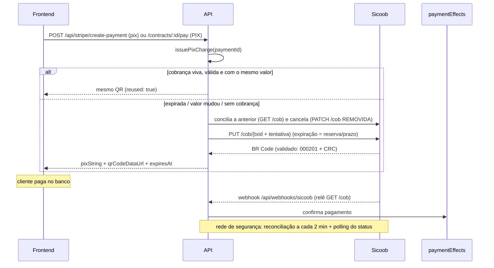
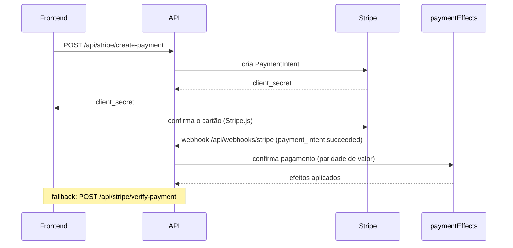

# Pagamentos

Provedores, roteados por método:

- **Stripe** — cartão de crédito (1× na conta BR atual; parcelado só numa conta que parcela — ver [Parcelamento](#parcelamento)), salvar cartão (SetupIntent) e cobrança automática (off-session). Não há assinatura Stripe (ver [Cobrança automática](#cobrança-automática-e9)).
- **Sicoob** — **PIX** (API Pix Bacen: `/cob`, txid). É o provedor de PIX preferido.
- **Cora** — **boleto** (e PIX, se o Sicoob estiver desligado). API bancária via mTLS. O boleto só existe com a chave-mestra ligada **e** a Cora habilitada (ver [Boleto](#boleto-e3)).

Arquivos-chave em [`backend/src/lib/`](../../backend/src/lib/): `paymentGateway.ts` (roteamento e estado do boleto), `pixGateway.ts` (PIX: `issuePixCharge`; desconto PIX do à vista), `savedCards.ts` (cartões salvos: posse e cartão padrão), `sicoobService.ts`, `sicoobReconciliation.ts`, `brcode.ts`, `stripeService.ts`, `coraService.ts`, `coraPaymentHelper.ts`, `coraReconciliation.ts` e, sobretudo, **`paymentEffects.ts`**.

## paymentEffects — fonte única de verdade

Quando um pagamento é confirmado (por **webhook** ou por **reconciliação**), todo o efeito colateral passa por `paymentEffects.ts`. Isso garante que webhook e reconciliação produzam exatamente o mesmo estado. Efeitos típicos:

- marcar o `Payment` como `PAID` (com checagem de **paridade de valor**);
- **ativar o contrato** (`AWAITING_PAYMENT` → `ACTIVE`, via `activateAwaitingContract`) e gerar os bookings (FIXO) / liberar créditos (FLEX);
- **renovação paga** (`generateBookingsForRenewedContract`, FIXO e personalizado): cada ocorrência é trancada com `createSlotClaimer` (a mesma trava Redis do avulso/`/custom`) e conferida no banco; **horário ocupado é pulado** (nunca sobrepõe). Personalizado usa `planCustomOccurrences` (semana a semana, volume = `sessionsPerCycle × meses`, o que a parcela cobra) e cada sessão pulada vira **crédito** (`customCreditsRemaining`) para o cliente agendar; FIXO pulado segue disponível pelo teto do plano. Grava sob `SELECT … FOR UPDATE` no contrato e com mutex Redis por contrato (duas confirmações não geram em dobro); Redis fora → confere só no banco. Contrato cancelado, em cancelamento, pausado ou expirado **nunca** gera (a função roda a cada pagamento confirmado com `contractId` — ex.: multa paga de um contrato cancelado antes da 1ª sessão);
- **promover as sessões reservadas** na ativação (D9, personalizado do cliente): `accessMode` FULL → todas as `RESERVED/HELD` viram `CONFIRMED`; PROGRESSIVE → só o 1º ciclo (as demais ficam `RESERVED` sem timer e são liberadas uma parcela por vez por `unlockNextCycleBookings`; a parcela que ativa não libera um 2º ciclo);
- **confirmar o booking** correspondente (avulso);
- **liberar serviços** (add-ons) contratados;
- disparar **notificações** (ex.: `PAYMENT_CONFIRMED`, `CONTRACT_ACTIVATED`).

## Fluxo PIX (Sicoob; Cora como alternativa)

```mermaid
sequenceDiagram
    participant FE as Frontend
    participant API as API
    participant SC as Sicoob
    participant EF as paymentEffects

    FE->>API: POST /api/stripe/create-payment (pix) ou /contracts/:id/pay (PIX)
    API->>API: issuePixCharge(paymentId)
    alt cobrança viva, válida e com o mesmo valor
        API-->>FE: mesmo QR (reused: true)
    else expirada / valor mudou / sem cobrança
        API->>SC: concilia a anterior (GET /cob) e cancela (PATCH /cob REMOVIDA)
        API->>SC: PUT /cob/{txid + tentativa} (expiração = reserva/prazo)
        SC-->>API: BR Code (validado: 000201 + CRC)
        API-->>FE: pixString + qrCodeDataUrl + expiresAt
    end
    Note over FE: cliente paga no banco
    SC-->>API: webhook /api/webhooks/sicoob (relê GET /cob)
    API->>EF: confirma pagamento
    Note over API,SC: rede de segurança: reconciliação a cada 2 min + polling do status
```

**`issuePixCharge(paymentId)`** (`lib/pixGateway.ts`) é a fonte ÚNICA de QR sob demanda (D15):

- **Preço PIX primeiro (E2)**: se a cobrança é um à vista que está no preço de cartão da marca (`amount === pixDiscount.cardAmount` e `pixAmount < amount`), o `amount` passa a valer `pixAmount` num `updateMany` condicional (PENDING, mesmo amount, mesma marca) **antes** de qualquer QR — ver [Desconto PIX bidirecional](#parcelamento). Com um PaymentIntent de cartão em andamento, nada muda e o PIX é recusado.
- **Reuso** só se a cobrança estiver viva (`Payment.pixExpiresAt` com ≥ 60 s de folga), for um BR Code válido e tiver sido emitida para o **mesmo valor** do Payment (`metadata.pixCharge.amount`). Linhas antigas sem `pixExpiresAt` nunca são reusadas.
- **Senão**: concilia a cobrança anterior (se já foi paga → `alreadyPaid`, nada é emitido), cancela-a no provedor (best-effort) e emite uma nova. O **txid** da 1ª emissão é o id do Payment sem hífens (compatível com o legado); da 2ª em diante leva o nº da tentativa em base36 (`metadata.pixCharge.attempt`). Na Cora a `Idempotency-Key` também ganha a tentativa.
- **Validade**: avulso em espera → até o fim da reserva (10 min, piso 120 s); contrato `AWAITING_PAYMENT` → `min(1 h, prazo restante)` (serviço = 10 min); demais (parcelas) → 1 h.
- Grava `provider`, `providerRef`, `pixString`, `pixExpiresAt` e `metadata.pixCharge` num único `updateMany` guardado por `PENDING`, e devolve `{ provider, providerRef, pixString, qrCodeDataUrl, expiresAt, amount, reused, alreadyPaid }`.
- **Troca de método**: ir para o cartão aposenta o PIX vivo (concilia + cancela) e limpa `pixString/pixExpiresAt`; um PaymentIntent de cartão `succeeded/processing` impede emitir PIX por cima. O reset de um Payment `FAILED` limpa `pixExpiresAt` e preserva o contador de tentativas.
- **Parcelas 2..N por PIX não são pré-geradas** (fulfillment do `/self`, do serviço e o `/custom`): o QR sai no clique em "Pagar". Boleto continua pré-gerado.
- **Mudança de valor** (`applyContractServiceChange`): as parcelas PENDING com PIX emitido para o valor antigo são conciliadas, a cobrança é cancelada e `pixString/providerRef/pixExpiresAt` são zerados. O mesmo vale para o **PaymentIntent** de cartão já emitido pelo valor antigo (`settleExistingCardIntent`, antes da transação): pagável → cancelado no Stripe e a linha perde `providerRef`/`chargedAmount` (o webhook aceita `chargedAmount ?? amount`, então sem isso uma aba de checkout aberta quitaria a parcela pelo valor antigo); aprovado, em processamento ou não consultável → a parcela **fica no valor antigo**, com o PI intacto (mesmo critério do QR que não pôde ser cancelado). O `chargedAmount` nunca é zerado com o PI ainda vivo.

**Validação do BR Code** (`lib/brcode.ts`: `crc16`, `isValidBrCode`, `buildStaticBrCode`): em **produção**, um EMV inválido do Sicoob vira erro (nunca se exibe um QR que o banco não lê). Em **sandbox/dev** (trava dupla: integração em sandbox **e** `NODE_ENV !== 'production'`), o texto aleatório do mock é trocado por um **BR Code sintético válido** com o valor, a chave e o txid (25 primeiros caracteres) reais — o banco lê e mostra o valor, mas a confirmação em sandbox é pelo "Simular pagamento". Sem nenhum provedor de PIX, `paymentGateway.createPayment` **falha em produção**; em dev devolve um BR Code válido com o valor real (antes era um EMV fixo de R$ 10 com CRC inválido).

**Conciliação Sicoob em sandbox**: o `GET /cob` do sandbox devolve status/criação aleatórios, então `reconcileSicoobCancellation` **não marca `FAILED`** em sandbox (antes derrubava o checkout ~2 min após gerar o QR). Em produção, só falha a cobrança ATUAL do Payment (o `providerRef` entra no `where`).

**Hardening** do `httpsCall` do Sicoob: erros/cortes no stream da **resposta** (`res.on('error' | 'aborted' | 'close')`) viram rejeição tratada em vez de exceção não tratada.

Se o webhook não chegar, o job de **reconciliação** (a cada 2 min, ver [jobs-e-crons.md](jobs-e-crons.md)) consulta o provedor e converge para o mesmo `paymentEffects`.

## Fluxo cartão (Stripe)

```mermaid
sequenceDiagram
    participant FE as Frontend
    participant API as API
    participant ST as Stripe
    participant EF as paymentEffects

    FE->>API: POST /api/stripe/create-payment
    API->>ST: cria PaymentIntent
    ST-->>API: client_secret
    API-->>FE: client_secret
    FE->>ST: confirma o cartão (Stripe.js)
    ST-->>API: webhook /api/webhooks/stripe (payment_intent.succeeded)
    API->>EF: confirma pagamento (paridade de valor)
    EF-->>API: efeitos aplicados
    Note over FE,API: fallback: POST /api/stripe/verify-payment
```

O webhook da Stripe exige o **corpo bruto** para verificar a assinatura — por isso `index.ts` registra `express.raw` em `/api/webhooks/stripe` antes do `express.json`. Há também `POST /api/stripe/verify-payment` como recuperação manual (verifica o PaymentIntent e confirma, checando a posse via `metadata.paymentId`).

**Recusa atrasada × aprovação no mesmo PaymentIntent (PAY-6)** — o cliente tem o cartão recusado, clica de novo antes de o webhook `payment_intent.payment_failed` chegar (o `create-payment` devolve o **mesmo** PI), a recusa atrasada marca a linha `FAILED` e o cliente paga com outro cartão no mesmo PI. Por isso o `payment_intent.succeeded` e o `verify-payment` baixam a linha `PENDING` **ou** a `FAILED` de cartão cujo `providerRef` é exatamente o PI aprovado (valor conferido antes). `FAILED` de outro PI ou de PIX e `CANCELLED` continuam de fora: fica um `[ALERTA]` no log e o `verify-payment` responde **409** `PAYMENT_NOT_SETTLED` — nunca `PAID` sem a linha estar `PAID`. E o `create-payment` não reabre essa linha antes da hora (Z1-e): numa `FAILED` cujo `providerRef` é um PI, o PI é consultado **antes** de reabrir (só leitura); `succeeded`/`processing`/`requires_capture` → **409** `CARD_PAYMENT_IN_FLIGHT` em qualquer forma pedida (cartão, PIX ou boleto) e a linha segue `FAILED` apontando para o PI, para o webhook/verify a baixarem. Antes, reabrir zerava o `providerRef` e um PIX emitido em seguida cobrava em dobro. Stripe desligado, PI inexistente ou consulta que falhou → reabre como antes (o PIX não depende do Stripe; o ramo cartão confere de novo pelo `settleExistingCardIntent`).

**Customer do Stripe** — `stripeGetOrCreateCustomer` só recria o Customer quando ele não existe mais (apagado, 404 ou `resource_missing`, ex.: troca sandbox ↔ produção). Erro transitório (rede, 429, 5xx) propaga: recriar nesse caso trocava o `stripeCustomerId` e deixava os cartões salvos presos ao Customer antigo.

## Parcelamento

A política de parcelas (máximo e parcelas sem juros) é calculada no backend (`getInstallmentPolicy` em `lib/paymentPolicy.ts`) conforme tipo/duração do contrato e devolvida por `POST /api/stripe/installment-plans` e `POST /api/pricing/checkout-quote`. **A cotação autoritativa vem sempre do servidor** — o frontend nunca decide o valor final.

Planos de pagamento de contrato:
- **MENSAL** — paga a 1ª parcela agora; as demais vencem mês a mês (e podem ser cobradas no cartão via `autoChargeJob` ou pagas manualmente). Cada mensalidade é 1×.
- **À VISTA (FULL)** — paga tudo de uma vez (desconto PIX quando aplicável); cartão 1–12×, sem juros até a duração, com juros acima. Avulso: 1–12×, sem juros só em 1×. **N× (N > 1) só quando o gateway parcela** (ver abaixo) — na conta Stripe BR atual, tudo é 1×.

**Desconto PIX do à vista — bidirecional (E2, 30/09/2026; substitui a regra "conservadora" D1)** — o desconto PIX vale **só no PIX**, mas agora nos dois sentidos: a cobrança à vista criada no cartão/boleto e paga no PIX **ganha** o desconto; a criada no PIX e paga no cartão **perde**. Tudo decidido por uma marca gravada na criação (`pixGateway.ts`):
- **A marca da criação** — **toda** cobrança à vista (plano `FULL`) grava `metadata.pixDiscount = { pct, cardAmount, pixAmount }` (`pixDiscountMetaForFullCharge`, preservando o resto do metadata), seja qual for a forma escolhida: admin (`POST /contracts`), `/self` (junto do `contractData`), `/custom` (semanal e datas livres), serviço (`/contracts/service`, inclusive o "mensal parcelado no cartão") e o `/pay` do serviço à vista (renovação). `cardAmount` = total sem o desconto PIX; `pixAmount` = total com o desconto; os dois com o **mesmo cupom em R$**. Criada no PIX → `amount` = `pixAmount`; criada no Cartão/Boleto → `amount` = `cardAmount`. Mudar `pix_extra_discount_pct` depois não altera nenhum dos dois preços.
- **PIX** (`issuePixCharge`) — cobrança pendente com `amount === cardAmount` e `pixAmount < amount` → o `amount` passa a valer `pixAmount` (update condicional atômico: só com a linha `PENDING`, no mesmo amount e com a mesma marca; dois cliques não baixam duas vezes) e o QR sai com o desconto. **Nunca com um PaymentIntent em voo** (`succeeded`/`processing`/3DS em andamento): o PIX é recusado e o valor não muda. O `chargedAmount` de um PI antigo é mantido (se ele ainda aprovar, casa pelo valor de cartão). **Ordem (PAY-3)**: o preço PIX é só calculado no início; o `amount` é baixado **depois** de conciliar/aposentar a cobrança anterior com o valor antigo — um boleto Cora já pago (webhook ainda não chegou) é reconhecido e devolve `alreadyPaid`, em vez de se perder sob um QR novo — e logo antes de emitir. Com repreço pendente, a cobrança viva de valor antigo nunca é reaproveitada nem adotada. Se a emissão falhar (provedor fora do ar, CPF ausente), o repreço daquele pedido é desfeito (update condicional: linha `PENDING`, ainda no preço PIX e com a mesma cobrança anterior), e o update que grava o QR grava também o `amount` — o valor da linha sempre acompanha o QR emitido.
- **Cartão** (`cardChargeBaseAmount`, usado por `create-payment`, `installment-plans`, `/contracts/:id/pay` e `autoChargeJob`) — quando o `amount` é o preço PIX da marca, cobra `cardAmount` (o valor do PI vai em `chargedAmount`; o `amount` não volta a subir); quando o `amount` já é o de cartão, cobra o próprio `amount`. **Nunca mais que o preço de cartão marcado.**
- **Boleto** cobra o preço de **cartão**: ao emitir um boleto de uma cobrança que está no preço PIX, o `amount` volta a `cardAmount` (update condicional). Voltando ao PIX, vale de novo o `pixAmount`.
- **Sem a marca → o próprio `amount`**, no PIX e no cartão. Mensalidades, avulso, extras de sessão (`bookingId`) e a multa de cancelamento nunca têm a marca — não há diferença de preço entre as formas. Cobranças à vista **anteriores** a esta regra: as criadas no PIX têm a marca antiga (o cartão cobra `cardAmount`, como antes); as criadas no cartão não têm marca (o PIX cobra o valor cheio). Não há fallback que adivinhe pelo estado atual do contrato (ele cobrava a mais — revisão final de 24/09/2026).
- **Marca caduca** — se o `amount` mudar sem a marca ser regravada (não é nem `cardAmount` nem `pixAmount`), PIX e cartão cobram o `amount`. Marca antiga sem `pixAmount`, ou com `pixAmount` inválido (≤ 0 ou ≥ `cardAmount`), nunca baixa o valor no PIX.
- **Valor zero nunca vai ao gateway** — cobrança de R$ 0 (cupom 100% ou cupom VALOR ≥ total) não recebe a marca, e um cupom que zeraria só o preço PIX também deixa a cobrança sem marca (`buildPixDiscountMeta` devolve `undefined` com `pixAmount` ≤ 0). `cardChargeBaseAmount` devolve 0 mesmo numa linha que tenha marca (`installment-plans` responde 400 "Valor inválido."). No `POST /contracts` do admin, as parcelas de R$ 0 nascem `PAID`; a 1ª passa por `onPaymentConfirmed` (uso do cupom `CONFIRMED` e demais efeitos de confirmação), como já faziam o `/self` e o `/custom`. Nada vai ao gateway nem ao `autoChargeJob`.
- **Troca da forma de pagamento pelo admin** (`PATCH /contracts/:id` `paymentMethod`) — nenhuma cobrança é regravada (nem marca, nem `amount`, nem provider). O preço de cada meio continua saindo da marca: o PIX cobra `pixAmount`, o cartão `cardAmount`.
- **Troca de serviços** (`applyContractServiceChange`) — à vista, **qualquer forma**: o valor novo e a marca dos dois preços são regravados juntos (PIX grava o preço PIX; cartão/boleto gravam o preço de cartão e o PIX continua saindo com o desconto). Com o desconto PIX em 0% ou plano mensal, a marca é removida. A **multa de cancelamento** pendente não é repreçada.
- As parcelas de R$ 0 criadas pelo admin antes de 24/09/2026 podem ter ficado `PENDING`. O cartão nunca cobra nada nelas (a base é 0), mas convém confirmá-las como pagas.
- **Preço por aba antes de gerar** — `POST /stripe/installment-plans` devolve `cardAmount` (o que o cartão cobra em 1x) e `pixAmount` (o que o PIX cobra).
- O checkout mostra no cartão o valor do plano 1× de `/stripe/installment-plans` (= `cardAmount`, o que o servidor cobra), no PIX o `pixAmount`, e avisa "O desconto à vista vale só no PIX" só quando os valores diferem.
- **PaymentIntent anterior** (`settleExistingCardIntent`, em `create-payment` e no cartão do `/contracts/:id/pay`): antes de criar um PI novo para a cobrança, o anterior (`providerRef` pi_…, inclusive o de uma linha `FAILED` reaberta) é conferido — `succeeded`/`processing`/`requires_capture` → 409 `CARD_PAYMENT_IN_FLIGHT` e nenhum PI novo; pagável com **outro valor** → cancelado antes (senão, pago numa aba aberta, viraria dinheiro sem registro: o webhook recusa valor divergente); falha ao consultar/cancelar → 503.

**Relatórios** — o fechamento (`GET /api/finance/closing/:ano/:mes`) e o resumo `GET /api/payments/summary` somam como bruto de um pagamento PAGO o valor **efetivamente cobrado** (`paidChargedAmount`: `chargedAmount` quando a cobrança paga foi a do cartão — provider STRIPE ou ref `pi_…`; senão `amount`), e, no fechamento, a taxa versionada do gateway incide sobre esse valor (`amount` na resposta = esse bruto; a base gravada vai em `baseAmount`). O mesmo critério vale para o "pago" de `GET /api/users` (`totalPaid`), da prévia de exclusão (`preserved.paidAmount`), do detalhe do contrato no admin (Valor do contrato / Pago), de Meus Pagamentos (total pago e histórico) e da saúde do cliente (`utils/clientHealth.paidChargedAmount` no front); pendente continua pelo `amount`. A **multa de cancelamento** não usa o "pago": a base é o que **falta pagar** do plano (ver [Cancelamento de contrato e multa](#cancelamento-de-contrato-e-multa-e13)). O `POST /stripe/create-payment` no cartão devolve `amount` (= `chargedAmount`, o valor do PaymentIntent) e `installments`; o checkout exibe esse valor no formulário do cartão novo.

**Serviço (SERVICO, D1)** — `POST /api/contracts/service` grava o teto em `Payment.metadata.installmentCap`, que a política lê (só para SERVICO; pagamentos antigos sem teto seguem a regra acima):
- **Mensal + PIX** (ou cartão sem `cardSplit`) → 1ª mensalidade agora, demais mês a mês.
- **Mensal + Cartão com `cardSplit: true`** → o **total** agora (plano gravado `FULL`; no cartão não há desconto PIX, mas a cobrança leva a marca dos dois preços — E2) em **até N× sem juros**, N = meses da fidelidade (`installmentCap = N`). O wizard só oferece essa opção quando o gateway parcela (`POST /stripe/installment-plans { amount, contractDurationMonths: N, installmentCap: N }` devolve mais que `[1x]`); na conta BR fica só "mês a mês".
- **À vista** → pagamento **único** (`installmentCap = 1`): PIX com desconto PIX ou cartão 1×. Não há mais 4×–12× com juros para serviço.
- Prazo de pagamento: **10 min** (`config.studio.lockTtlSeconds`); o QR PIX expira junto. Uma nova contratação do mesmo serviço substitui a anterior ainda não paga (mesma rotina segura da varredura).

**O nº de parcelas chega ao Stripe?** A conta Stripe é **BR** e o Stripe **não oferece parcelamento no Brasil** (verificado no modo teste: `available_plans` sempre vazio; plano recusado na confirmação, inclusive via ConfirmationToken). Regra no servidor (`stripeService.ts`):
- `stripeCardInstallmentsSupported()` lê o país da conta (cache de 6 h; falha → `false`; só MX/JP parcelam). `cardInstallmentsBlockReason()` libera N× (N > 1) **só com cartão SALVO numa conta que parcela**, confirmado no servidor com `payment_method_options.card.installments.plan` conferido em `available_plans` (se o cartão não oferece N×, o PI é cancelado e o cliente recebe erro claro).
- **Cartão novo** com N > 1 → `POST /stripe/create-payment` responde **400 `INSTALLMENTS_UNAVAILABLE`** antes de qualquer efeito (reabrir FAILED, aposentar PIX, criar PI). O PI só habilita `installments` quando o servidor fixa o plano — o Payment Element nunca mostra o seletor de parcelas do Stripe.
- Conta sem parcelamento → `POST /stripe/installment-plans` e `POST /pricing/checkout-quote` devolvem **só 1x** (`maxInstallments`/`freeUpTo` = 1). As telas que prometiam "até N× sem juros" (serviço, contrato fixo/flex, personalizado, criação pelo admin) só mostram o parcelamento quando essas rotas devolvem mais que 1x — o dia em que o gateway parcelar, tudo volta a aparecer sozinho.
- Para parcelar cartão novo numa conta que parcela (MX/JP, ou se o Stripe liberar BR — acrescentar o país em `STRIPE_INSTALLMENT_ACCOUNT_COUNTRIES`): Elements em modo diferido + `stripe.createConfirmationToken`, endpoint novo que confirma o PI com `confirmation_token` + `installments.plan` (N da política) e `stripe.handleNextAction` para 3DS.

## Front — InlineCheckout (checkout único)

`components/InlineCheckout.tsx` é o **único** checkout (wizards de contrato/serviço/personalizado, BookingModal, PaymentModal, ChargeNowSheet, detalhe do contrato no admin). Toda cobrança sai de `POST /api/stripe/create-payment` a partir do `paymentId`:

- **Contrato de uso**: o pai passa só `paymentId` **ou** `createPaymentFn(method) → { paymentId }` (ex.: reserva avulsa criada na 1ª escolha de método). `pixString`/`qrCodeBase64` devolvidos por `createPaymentFn` são ignorados — o PIX vem sempre do create-payment (com validade e reuso da cobrança viva).
- **PIX** (D15): o bloco é o `<PixQrCode>` com `qrCodeDataUrl`/`expiresAt`/`amount` da resposta. `alreadyPaid`/`status: 'PAID'` → `onSuccess`. O polling (5 s) acompanha a validade: ao expirar, **pausa** e faz uma última conferência 4 s depois (PIX pago no limite). `FAILED` no polling vira o estado **"QR expirado — Gerar novo QR"** (sem `onError`, que derrubava o wizard do pai); "Gerar novo QR" chama o create-payment de novo e reinicia o polling. Sair da aba PIX descarta o QR exibido (a troca para cartão aposenta a cobrança no backend).
- **Cartão**: o seletor de parcelas usa `/stripe/installment-plans` com o `paymentId` (teto do serviço incluso; carregado sempre que o cartão está disponível, não só na aba Cartão) e só aparece com mais de 1 opção; enquanto a política carrega o botão do cartão fica desabilitado. **Valor exibido = valor cobrado**: no cartão, o total/botões usam o plano 1x (ou o N escolhido) devolvido pelo servidor — sem o desconto PIX do à vista; no PIX, o `amount` da cobrança. Se diferem, o checkout mostra "O desconto à vista vale só no PIX (R$ X). No cartão, o valor é R$ Y." Quando o N pedido (`initialInstallments`) não está disponível, avisa "O parcelamento em Nx não está disponível no cartão no momento: o total é cobrado em 1x". Trocar o nº de parcelas descarta o PaymentIntent do cartão novo (refeito no "Continuar"). Erro ao iniciar cartão/PIX/boleto numa cobrança que já consta `PAID` (ex.: "já confirmado via PIX") vira sucesso.
- **Cotação indisponível** (`/stripe/installment-plans` falhou) com a cobrança já criada: o `amount` pode ser o preço PIX do à vista, então ele **não** é mostrado como preço do cartão/boleto — o cabeçalho e os botões ficam "A confirmar"/"valor a confirmar", o **cartão salvo fica bloqueado** (seria debitado na hora pelo preço de cartão) e aparece o aviso com **"Tentar de novo"** (refaz a cotação). PIX e cartão novo seguem liberados (o formulário do cartão novo mostra o `amount` devolvido pelo create-payment). Na prévia de um wizard (sem `paymentId`) nada é bloqueado.
- **"Salvar cartão"**: a caixa fica **antes** do botão "Continuar com novo cartão" (marcada por padrão) e o valor vai em `savePaymentMethod` no create-payment — é o PaymentIntent que leva `setup_future_usage`, então a escolha precisa existir antes dele. Dentro do formulário do Stripe só há o aviso do que vai acontecer ("Este cartão ficará salvo…"/"não será salvo"); para mudar, "Voltar". O `StripeCardForm` do checkout usa `showSaveCard={false}`.
- **Erros**: aparecem uma vez, dentro do checkout, e somem ao trocar de aba. O `ChargeNowSheet` não repete o alerta (a prop `error` dele é ignorada); o `onError` continua avisando o pai (toast nas telas do cliente).
- Props opcionais: `initialMethod` (aba aberta primeiro — a forma de pagamento do contrato; um PIX abre no PIX; se não estiver disponível, a 1ª) e `initialInstallments` (parcelas pré-selecionadas no crédito; a política do backend manda — cai para a maior opção ≤ N).
- **PaymentModal** (Meus Pagamentos): recebe `initialMethod` (o aviso do desconto PIX agora vem do próprio InlineCheckout) e, para contratação aguardando pagamento, `paymentDeadline` + `onDeadline` — mostra "Conclua o pagamento até HH:MM" com a contagem acima do checkout; ao zerar, a página confere o status uma vez (PIX pago no limite → "Pagamento confirmado!"), senão fecha o modal com "Tempo esgotado…" e recarrega.
- `onSuccess` dispara **uma vez** (polling, simulação e "já pago" podem concorrer); `onSuccess`/`onError` são lidos por ref (o polling sempre chama a versão atual do pai). Erros do polling aparecem no próprio checkout e também vão ao `onError`.
- **Serviço** (`ServiceContractWizard`, D1/D2): Visão geral → Fidelidade + forma de cobrança → Forma de pagamento (Mensal+Cartão: "Pagar mês a mês" × "Parcelar o total em até N× sem juros" → `cardSplit: true`, e o checkout já abre em N× — a 2ª opção só aparece quando o gateway parcela (hook `useCardInstallments`); na conta BR fica só o mês a mês; com fidelidade de 1 mês não há sub-escolha; À vista = PIX com desconto ou cartão 1×) → Pagamento com contagem de 10 min a partir de `paymentDeadline` (expirou → volta à forma de pagamento com aviso) → Sucesso. 409 do `/contracts/service` (contratação anterior paga ou em processamento) vira aviso no passo "Forma de pagamento". Fechar no checkout pede "Sair sem pagar?" (tom warning) e a lista do pai recarrega ao fechar.
- **Meus Contratos** ("Pagar Agora" do banner `AwaitingPaymentBanner`, prop `variant: 'booking' | 'service' | 'contract'`): avulso e **serviço** vão direto à cobrança pendente (sem `/pay`); os demais chamam `/pay` com o `paymentMethod` do contrato (PIX continua PIX; boleto com cobrança existente vai direto). O banner mostra hh:mm:ss acima de 1 h e a barra de progresso pelo prazo real (`createdAt` → `paymentDeadline`, sem passar de 100%).

## Métodos por contexto

`PaymentMethodConfig.contexts` (CSV `avulso,contract,invoice`) controla onde cada método aparece.

## Boleto (E3)

Provedor: **Cora**. Fonte única: `getBoletoStatus()` em `lib/paymentGateway.ts` → `{ enabled, providerEnabled, available, reason, message }`.

- **Chave-mestra** = `PaymentMethodConfig` `BOLETO.active` ("Aceitar pagamento por boleto", em Configurações → Pagamentos). Nasce **desligada** em instalação nova (todos os seeds — `seed.prod.ts`, `seed.ts`, `seed_pm.sql`, `scripts/seedPaymentMethods.ts` e o auto-seed de `GET /pricing/payment-methods/all` — gravam `active: false`). Num banco **já existente** a coluna herda o valor que tinha (os seeds antigos gravavam `true`): a migração só de dados `20260930000100_boleto_switch_default_off` desliga a chave quando a Cora **não** está habilitada (quem já opera boleto com a Cora ligada não é tocado; idempotente). Assim, ativar a Cora por qualquer motivo (ex.: contingência de PIX) nunca libera o boleto sozinho: o dono precisa ligar o switch. No deploy, conferir `SELECT active FROM payment_method_config WHERE key = 'BOLETO'`.
- **Boleto efetivo** (`available`) = chave ligada **e** integração Cora habilitada (com credenciais do ambiente ativo). `reason`: `PROVIDER_DISABLED` (Cora inativa — tem precedência) ou `SWITCH_OFF`.
- **Ligar a chave sem a Cora ativa → 400** `BOLETO_PROVIDER_DISABLED` (`PUT /pricing/payment-methods/boleto` e o `PUT /pricing/payment-methods` em lote, que não grava nada). Desligar é sempre permitido e não cancela boletos já emitidos.
- A mesma fonte é usada por `GET /pricing/payment-methods` (só lista `BOLETO` quando efetivo e devolve `boleto` para as telas — **saneado**, por ser rota pública: só `available` informa, `reason`/`message` vêm `null`; o estado completo, com a posição da chave, a Cora e o motivo, fica em `GET /pricing/payment-methods/all` e nos `PUT`, só para ADMIN), `validatePaymentMethod`, `create-payment` (ramo boleto), `POST /contracts` e `POST /contracts/custom` do admin, `POST /bookings/admin` e pelo próprio `createPayment` do gateway — que em **produção** lança erro em vez de devolver um boleto mock (antes, com a Cora desligada, um link falso podia ir ao cliente nas parcelas pré-geradas).
- **`Contract.boletoAllowed` deixa de ser autoridade**: o `create-payment` não olha mais a coluna (ela fica sem uso) e o `boletoAllowed` dos corpos é ignorado.
- **Onde o boleto NÃO entra** (compensa em até 3 dias úteis; a varredura desfaria a contratação antes): reserva de 10 minutos do avulso do cliente, `/self`, serviço, personalizado do cliente e a renovação aguardando pagamento — as rotas de criação respondem 400 `BOLETO_NOT_ALLOWED_HERE` e o `create-payment` recusa boleto para cobrança de contrato `AWAITING_PAYMENT`, sem contrato (`/self`) ou com reserva em espera (`boletoBlockedForPayment`), inclusive para o admin.
- **Onde entra**: cobranças feitas pelo admin (contrato/personalizado/avulso criados no painel, "Cobrar") e parcelas/faturas de contratos já ativados (Meus Pagamentos), inclusive a multa de cancelamento.
- O boleto cobra o **preço de cartão** (o desconto do à vista é só do PIX — E2).
- `PATCH /contracts/:id` trocando a forma para `BOLETO` segue a mesma fonte: boleto indisponível → 400 `BOLETO_UNAVAILABLE` e nada do PATCH é gravado.
- **No front** a regra tem dois sinais, e o backend é sempre a autoridade final:
  - `isBoletoAvailable()` (`constants/paymentMethods.ts`) = `boleto.available` de `GET /pricing/payment-methods` (chave + Cora);
  - `offerBoleto` (prop do `InlineCheckout`, padrão `false`) = "este checkout pode ter boleto". A aba só aparece com os dois verdadeiros, sem `createPaymentFn` (cobrança criada sob demanda = fluxo de 10 minutos) e com `BOLETO` em `allowedMethods`; um boleto já emitido continua visível. Quem liga: `ChargeNowSheet` (toda cobrança do admin — de contrato **ou avulsa**: a avulsa do admin nasce num contrato `AVULSO` já ativo, com reserva sem prazo de 10 minutos; a aba ainda respeita os contextos `avulso`/`contract` do método Boleto nas Configurações) e o `PaymentModal`, que decide sozinho — `offerBoleto ?? (contractDuration != null)`, sem prazo correndo e com `contractStatus !== 'AWAITING_PAYMENT'`. Wizards do cliente e o serviço extra de gravação (`BookingDetailModal`) nunca oferecem. `allowBoleto` e `contract.boletoAllowed` são ignorados.
- Pendência conhecida (anterior a esta regra): trocar de boleto para PIX/cartão na mesma cobrança não cancela o boleto já emitido na Cora (só a fatura de PIX é cancelada); se o cliente pagar os dois, o boleto não casa mais com o `Payment`. O conserto é em `retirePixCharge` (`pixGateway.ts`, ramo Cora, que hoje pula o boleto puro) com os mesmos passos que a anulação de parcelas já usa (conciliar → `coraCancelBoleto` → conferir a fatura); não foi feito porque o webhook `INVOICE.CANCELLED` da Cora marca como `FAILED` o `Payment` que ainda aponta para a fatura, e isso só dá para validar com a Cora ligada.

## Cobrança automática (E9)

Um único mecanismo: **`User.autoChargeEnabled` + cartão padrão (`SavedPaymentMethod.isDefault`) + `autoChargeJob`** (diário, off-session). É por **cliente**: vale para todos os contratos dele.

- **"Ativar cobrança automática"** (`POST /contracts/:id/subscribe`) não cria mais assinatura Stripe nem `Payment`. A assinatura paralela criava uma 4ª cobrança sobre um contrato que já tinha as parcelas geradas (cobrança em dobro), ficava `incomplete` e os webhooks de invoice não a casavam. Agora a rota liga `autoChargeEnabled` e torna o cartão informado o padrão (`{ paymentMethodId }` = id do `SavedPaymentMethod` ou `pm_…`). O cartão tem de ser do próprio cliente e de **crédito** (débito/pré-pago → 400 `CARD_NOT_CREDIT`). Idempotente. Não é oferecida para contrato à vista quitado (400 `NOTHING_TO_CHARGE`).
- **Cartão novo dentro do modal**: `POST /stripe/setup-intent` → `stripe.confirmSetup` (Elements) → `POST /stripe/setup-intent/confirm { setupIntentId }` grava o cartão na hora (sem esperar o webhook `setup_intent.succeeded`, e sem duplicar a linha dele) → `POST /contracts/:id/subscribe` com o `card.id`. O `/subscribe` também aceita o `pm_…` direto e sincroniza o cartão.
- **Estado**: `GET /stripe/auto-charge` → `{ autoChargeEnabled, defaultCard, … }` (o cartão que o job usaria: o padrão ou, sem padrão, o mais recente). Desligar: `PUT /stripe/auto-charge { enabled: false }` — sempre aceito, sem consultar o Stripe.
- **Crédito obrigatório também no interruptor** (`PUT /stripe/auto-charge { enabled: true }`, usado em Meus Pagamentos): antes de ligar, o cartão que o job cobraria é conferido no Stripe com as mesmas funções do `/subscribe` (`resolveUserCard` com `verify` + `isNonCreditFunding`). Débito/pré-pago → 400 `CARD_NOT_CREDIT` (mesma mensagem do `/subscribe`); `funding` `unknown` é aceito. Sem cartão salvo → 400 (sem código, como antes). Cartão que não pôde ser conferido não liga: Stripe desligado → 503, falha na consulta → 502, cartão inexistente no Stripe ou de outro Customer → 404 `CARD_NOT_FOUND`. **O cartão cobrado é o conferido**: ao ligar (aqui e no `PATCH /users/:id/auto-charge` do admin) o cartão aprovado **vira o padrão** (`lib/savedCards.pinAutoChargeCard`: banco, que é de onde o job lê, + padrão no Stripe em best-effort — o mesmo mecanismo do `/subscribe`). Antes, sem padrão marcado, o job cobrava "o salvo mais recente" e um cartão salvo depois (que nasce sem conferência de tipo) assumia a cobrança. O que **não** é conferido: o estado legado, de quem já estava com ela ligada antes desta regra — num cartão de débito, ou sem cartão padrão (o próximo cartão salvo é cobrado sem conferência até ligar de novo, trocar o padrão ou remover o cartão; a troca e a remoção são conferidas — item abaixo).
- **Conferência única** (`lib/savedCards.checkAutoChargeCard`): usada por `PUT /stripe/auto-charge`, `POST /contracts/:id/subscribe`, `PATCH /users/:id/auto-charge` (admin, mensagens na 3ª pessoa) e pelos dois casos a seguir. **Troca do padrão** (`PUT /stripe/payment-methods/:pmId/default`; `makeDefault` do `setup-intent/confirm`) com a cobrança automática ligada: cartão que não é de crédito → 400 `CARD_NOT_CREDIT` e o padrão não muda. **Remoção do cartão cobrado** (`DELETE /stripe/payment-methods/:pmId`): o substituto (o salvo mais recente) passa pela conferência e, aprovado, **vira o padrão** (`pinAutoChargeCard`); se esse substituto não existe ou não passa na conferência (débito/pré-pago, não conferido), a cobrança automática é **desligada** e a resposta avisa (`autoChargeDisabled`, auditoria `AUTO_CHARGE_DISABLED`).
- **Posse do cartão** (`lib/savedCards.ts`, `resolveUserCard`): um cartão só é aceito se for do usuário — linha dele em `saved_payment_methods` ou cartão anexado ao Customer dele no Stripe.
- **Nunca cobrados pelo job**: a multa de cancelamento (`metadata.kind = 'CANCELLATION_FINE'`), contratos `PAUSED`/`PENDING_CANCELLATION`/`CANCELLED`, contratações `AWAITING_PAYMENT` de prazo curto e linhas legadas com `stripeSubscriptionId`.
- **Só parcelas do plano** (`bookingId: null`): cobranças de uma **gravação** (extras de gravação, cobrança de uma reserva criada pelo admin — têm `bookingId`) nunca são debitadas pelo job; partem sempre do cliente (Meus Pagamentos) ou do "Cobrar" do admin. Antes, um checkout de extra abandonado era cobrado e ativado na rodada seguinte.
- **Checkout de cartão aberto**: antes de cobrar, o job relê a situação atual da parcela e pula a rodada se há um PaymentIntent dela aguardando o cliente (`requires_payment_method`/`requires_confirmation`/`requires_action`, criado há menos de 30 min — `cardIntentAwaitingCustomer`), como já fazia com o QR PIX vivo. Depois de quitar, o PaymentIntent anterior da parcela é cancelado em best-effort (nunca antes: a chave de idempotência do checkout devolveria o PI cancelado). O cancelamento é disparado junto com os efeitos da confirmação (`onPaymentConfirmed`) e só aguardado depois deles — uma chamada ao Stripe nunca fica entre o `PAID` e os efeitos (Z1-b). Se o Stripe responder que o PI anterior **já tinha aprovado**, o cliente foi cobrado duas vezes: os admins são avisados para estornar (item abaixo); ainda **processando** → `console.error` `[AUTO-CHARGE][SECURITY]`, e se ele aprovar o webhook dá o aviso.
- **Cobrança em dobro no cartão (Z1-c)** — `alertDoubleCardCharge` (`jobs/autoChargeJob.ts`) avisa **todos os admins** (evento `admin_card_double_charge`, persistido + push, link para o Financeiro: cliente, valor, o PI da baixa e o PI a estornar no painel do Stripe) e grava a auditoria `DOUBLE_CARD_CHARGE` (entidade `PAYMENT`, com os dois PIs), que garante **um** aviso por PaymentIntent excedente. Origens: o cancelamento acima e o webhook `payment_intent.succeeded` quando a cobrança **já está `PAID` por outro PaymentIntent** (antes o evento era ignorado em silêncio); o mesmo PI da baixa (reentrega, webhook depois do verify) não avisa. Paga por PIX/boleto (referência que não é `pi_`) e o cartão aprovado depois: só `console.error` `[Webhook:Stripe][SECURITY]` para conferência. **Limite conhecido:** a baixa manual pelo admin mantém o `providerRef` do checkout de cartão que estava aberto; se esse mesmo PaymentIntent for aprovado depois, nada avisa (o cliente pagou duas vezes) — conferir no Stripe ao dar baixa manual numa cobrança com checkout de cartão aberto. A linha não muda — o estorno é manual no Stripe.
- **Só crédito**: a conferência do `funding` acontece ao ligar, trocar o padrão e remover o cartão (itens acima). O job em si não reconfere, porque `saved_payment_methods` não guarda o `funding` — conferir a cada cobrança exigiria uma chamada ao Stripe por parcela.
- Código removido: `stripeCreateSubscription`. `stripeCancelSubscription` continua para encerrar uma assinatura antiga ligada a parcelas anuladas. Os handlers `invoice.*` do webhook ficam sem uso.

## Admin cobrando o cliente (E1)

No `POST /stripe/create-payment` o **pagador é sempre o dono do pagamento**, mesmo quando quem chama é o admin:

- **PIX**: o CPF/CNPJ do QR é o do cliente. Cliente sem documento válido → 400 `CPF_CNPJ_REQUIRED` com `payerUserId` (o CPF do admin nunca é usado).
- **Cartão salvo**: `GET /stripe/payment-methods/for-payment/:paymentId` (ADMIN) lista os cartões do cliente e o pagador (nome e CPF); `create-payment` aceita `savedPaymentMethodId` do cliente (id do banco ou `pm_…`) e recusa cartão de outra pessoa, inclusive o do admin (400 `CARD_NOT_FOUND`). O PaymentIntent sai no Customer do cliente.
- **Cartão novo**: o PaymentIntent também sai no Customer do cliente (`savePaymentMethod: true` guarda o cartão para ele — só com a caixa "Salvar o cartão do cliente para futuras cobranças" marcada **antes** de "Continuar com novo cartão"; desmarcada, o PaymentIntent nasce sem `setup_future_usage` e o cartão não fica no cliente).
- **Boleto**: quando efetivo (E3), no nome/CPF do cliente.
- A **multa de cancelamento** é cobrável assim mesmo com o contrato `CANCELLED` ("Cobrar agora").
- **Trilha de quem cobrou**: o admin cobrando o cartão do cliente grava `audit_logs` (entidade `PAYMENT`, `performedBy` = admin): `ADMIN_CHARGED_SAVED_CARD` (cartão salvo) ou `ADMIN_CHARGE_STARTED` (cartão novo), com pagador, PaymentIntent, valor e parcelas. É o início da cobrança; a aprovação vem do webhook/verify.
- **Gravação cancelada**: cobrança com `bookingId` de uma gravação `CANCELLED` não é mais pagável — 400 `BOOKING_CANCELLED` no `create-payment` (cliente e admin), e o `/contracts/:id/pay` nunca a reaproveita. Mais que isso (Z1-d): o `/contracts/:id/pay` só reaproveita cobrança do **plano** (`bookingId: null`) — um extra de gravação, viva ou cancelada, nunca é cobrado como "a parcela do contrato" (antes, vencendo antes da parcela, era ele o pendente escolhido e o contrato não ativava). Extras são pagos pela própria cobrança (`create-payment`).

## Modo sandbox e simulação

- `GET /api/payments/sandbox-mode` informa se o gateway está em sandbox.
- `POST /api/payments/:id/simulate` confirma um pagamento **sem cobrança real** (apenas sandbox/dev) — usado nos testes E2E (o modal de PIX mostra o botão "Simular pagamento PIX").
- **Critério único dos dois** (`isProviderSandbox`, `payments.client.ts`): o provedor precisa estar **habilitado** e no ambiente `sandbox`; no Sicoob, também no ambiente que o deploy pode operar (`sicoobAllowedEnvironment` — num servidor `NODE_ENV=production` o Sicoob em sandbox não conta). Não há bloqueio cego por `NODE_ENV`: uma homologação publicada com o provedor efetivo em sandbox continua simulando.
- **Provedor efetivo da cobrança** no `/simulate`: cartão → Stripe; PIX/boleto → quem **emitiu** a cobrança (linha com `providerRef`) ou, se a linha ainda é placeholder (o `CORA`/`SICOOB` gravado na criação, sem cobrança emitida), o provedor de PIX ativo (`resolvePixProvider`). Uma integração **desligada** nunca habilita a simulação — antes, a linha da Cora esquecida em `sandbox` (desligada) deixava qualquer cliente confirmar um avulso sem pagar. Recusa → 403.

## Cancelamento de contrato e multa (E13)

Regra do dono (30/09/2026), implementada em [`lib/cancellationFine.ts`](../../backend/src/lib/cancellationFine.ts), `contract.lifecycle.ts` e `paymentEffects.ts`. **Sem migration**: a marca do pedido e a data do cancelamento ficam em `audit_logs` (`entityType: 'CONTRACT'`), como já acontece com PAUSED/RESUMED/RENEWED.

**Base e valor**
- Base = o que **falta pagar do plano**: soma do `amount` das parcelas do contrato `PENDING` ou `FAILED`, **sem `bookingId`** (extras de uma gravação não entram) e sem a própria multa (`remainingPlanAmount`).
- Multa = `cancellation_fine_pct`% da base (`computeFineAmount`, arredondada ao centavo). **À vista quitado** (nada a pagar) → base 0 → **sem multa**, e nada é devolvido automaticamente.
- **Congelada no pedido**: `POST /contracts/:id/request-cancellation` muda o contrato para `PENDING_CANCELLATION` e grava, na mesma transação, a auditoria `CANCELLATION_REQUESTED` com `{ baseAmount, finePct, fineAmount, installments: [{ id, amount }] }` (`freezeCancellationFine`) — `installments` é a lista das parcelas que compõem a base. Mudar o % depois do pedido **não altera** a multa, e a base **nunca aumenta**. Pedido anterior a esta regra (sem a marca): a base é calculada na decisão, antes de anular as parcelas, e a marca é gravada com `lateFreeze: true` (`resolveCancellationBasis`).
- **Base efetiva = mínimo entre a congelada e o que ainda falta pagar** (`effectiveFineBase` / `effectiveCancellationBasis`): congelar impede a base de aumentar, mas nunca faz o cliente pagar multa sobre parcela já quitada. Uma parcela da base paga durante a análise — QR PIX ou PaymentIntent emitido **antes** do pedido, cobrança feita pelo admin, ou confirmada no provedor na hora de anular — **sai** da base. Vale na decisão e em toda prévia (`fineBaseAmount` / `fineAmountPreview` de `GET /contracts`, `/contracts/:id` e `/contracts/my`). Base efetiva 0 → sem multa, pelo mesmo caminho do à vista quitado. Exemplo: 3 parcelas em aberto no pedido, 1 paga depois → multa = % × 2 parcelas.
  - Conta: soma, entre as parcelas da lista do pedido, as que não foram pagas (`PENDING`/`FAILED`/`CANCELLED`), cada uma pelo **menor** valor entre o congelado e o atual. Parcela nova ou valor reajustado para cima depois do pedido não entram. `CANCELLED` conta porque quem anula parcela durante a análise é o próprio cancelamento — assim uma nova tentativa da decisão (falha depois de anular) chega ao mesmo valor.
  - Marca antiga sem `installments` (pedidos feitos antes desta lista existir): mínimo entre a base congelada e o saldo do plano no momento da leitura.
- **Durante a análise o cliente não paga parcela do plano**: `POST /stripe/create-payment` e `POST /contracts/:id/pay` respondem **409 `CANCELLATION_PENDING`** ("Este contrato está com cancelamento em análise. Aguarde a decisão do estúdio.") antes de qualquer efeito (`planPaymentBlockedByPendingCancellation`, em `lib/cancellationPending.ts`). O admin continua cobrando; extras de gravação (`bookingId`) e a multa seguem pagáveis. O bloqueio só impede **emitir** cobrança nova — um QR já emitido ainda pode ser pago, e é para esse caso que existe a base efetiva. Os avisos "Pagamento vencido" e "Pagamento com cartão falhou" do cliente seguem a mesma regra e não citam essas parcelas (ver [notificacoes.md](notificacoes.md)).

**Decisão do admin** (`POST /contracts/:id/resolve-cancellation`)
0. **exclusividade**: trava Redis por contrato (`mutex:contract-cancel:<id>`, a mesma do `DELETE` e do `PATCH` que cancela) e o status é **relido** com ela na mão. Quem chega depois espera (~15 s) e recebe **409** — `CANCELLATION_NOT_PENDING` se o pedido já foi resolvido, `CANCELLATION_IN_PROGRESS` se a outra requisição ainda não terminou — sem anular nada nem falar com o provedor;
1. lê a base congelada;
2. anula as parcelas em aberto (`voidContractPendingPaymentsDetailed`, abaixo);
3. relê as cobranças e calcula a base efetiva (**depois** de anular: a parcela que o provedor confirmou como paga já está `PAID` e sai da base);
4. numa transação: `PENDING_CANCELLATION → CANCELLED` por `updateMany` condicional (dois admins/duplo clique → o 2º recebe 409 e **nunca** nascem duas multas), cria a multa e grava a auditoria `CANCELLED` (com `baseAmount` = base cobrada e `frozenBaseAmount` = base do pedido).
- `CHARGE_FEE` com multa > 0 → `Payment` `PENDING`, `dueDate` = agora, `provider` pela forma do contrato e **`metadata = { kind: 'CANCELLATION_FINE', finePct, baseAmount }`** — `baseAmount` é a base **efetiva**, então `amount` = `finePct`% de `baseAmount`. `WAIVE_FEE` (ou base 0) → nenhuma cobrança.
- **Nunca duas multas em aberto**: num contrato reaberto pelo admin e cancelado de novo, a decisão que gera uma multa nova aposenta no provedor e anula antes a multa `PENDING`/`FAILED` do cancelamento anterior (`onlyFines`; se o provedor disser que ela já foi paga, fica `PAID`). Sem multa nova (isenção ou base 0), a anterior **continua devida** e a mensagem ao admin avisa.
- Mensagens de "sem multa" (pedido e decisão) dizem o motivo verdadeiro: base 0 → "não há parcelas do plano em aberto"; base > 0 com multa 0 (percentual zerado) → "o cancelamento não tem multa".
- A multa **nunca** é cobrada pelo `autoChargeJob` (contrato `CANCELLED` + checagem explícita do `kind`). O cliente paga em Meus Pagamentos e o admin pode cobrar na hora: `POST /stripe/create-payment` aceita a multa com o contrato cancelado (PIX ou cartão, valor = `amount`; ela não tem marca de desconto PIX).
- Multa paga: `onPaymentConfirmed` só confirma o cupom e envia "Pagamento confirmado" — **não** roda os efeitos de contratação (ativar contrato, gerar sessões/parcelas, liberar ciclo). `generateRemainingInstallments` também ignora contratos `CANCELLED`/`PENDING_CANCELLATION`.
- As telas identificam a multa por `kind === 'CANCELLATION_FINE'` (campo derivado do metadata em `GET /contracts/my` e `GET /contracts/:id`) — rótulo "Multa de cancelamento", fora da contagem "Parcela N/Total". Multas geradas antes desta regra não têm a marca e continuam aparecendo como parcela.

**Gravações** — pedido do cliente, `DELETE /contracts/:id` e `PATCH` com `status: 'CANCELLED'` cancelam só as gravações que **ainda não aconteceram**: `RESERVED`/`CONFIRMED`/`HELD`, sem "Iniciar gravação", com início (data + hora) no futuro pelo relógio de São Paulo (`upcomingContractBookingsWhere`, mesmo critério da exclusão de cliente). `COMPLETED`, `FALTA`, `NAO_REALIZADO` e a sessão de hoje que já começou ficam como estão.
- **Extras das gravações canceladas pelo pedido**: o `request-cancellation` anula na hora as cobranças `PENDING`/`FAILED` de extras (`bookingId`) das gravações que ele mesmo cancelou — mesma sequência da anulação abaixo (concilia → cancela no provedor → anula; já pago fica `PAID`). Extras de gravações já realizadas continuam pagáveis e as parcelas do plano só são anuladas na decisão.

**Anulação das parcelas** (`voidContractPendingPayments` / `…Detailed`, usada por todo cancelamento de contrato e pela exclusão de cliente)
- **Antes** de anular, a cobrança viva de cada parcela em aberto é aposentada no provedor: PIX → `retirePixCharge` (concilia e remove a cob/fatura); boleto puro da Cora → concilia e cancela a fatura; cartão → consulta o PaymentIntent (pagável → `stripeCancelPaymentIntent`).
- **Já pago no provedor** (PIX `CONCLUIDA`, PI `succeeded` com valor e posse conferidos) → a parcela vira **`PAID`** com todos os efeitos, **não** `CANCELLED`.
- Best-effort: falha do provedor **não** bloqueia o cancelamento. A parcela é anulada e a cobrança fica registrada como "viva" (`liveAtProvider` na resposta, aviso na mensagem ao admin).
- Parcelas `FAILED` também viram `CANCELLED` (num contrato cancelado nada continua pagável além da multa, criada depois). `PAID`/`REFUNDED` nunca são tocadas.
- A **multa de cancelamento nunca é anulada por padrão** (filtro por `metadata.kind`, em JS): uma segunda requisição de cancelamento — outra decisão, `DELETE`/`PATCH` concorrentes, ou o contrato reaberto e cancelado de novo — não apaga a multa já criada. Opções de escopo (`VoidContractPaymentsOpts`): `includeFines` (só a exclusão de cliente, que anula também a multa), `onlyFines` (a decisão que substitui a multa anterior) e `bookingIds` (extras das gravações canceladas pelo pedido).
- `DELETE /contracts/:id` e o `PATCH` com `status: 'CANCELLED'` rodam sob a mesma trava da decisão, relendo o status: se o contrato já foi cancelado por outra requisição, não anulam nem avisam o cliente de novo. Os dois devolvem `voidedCount`, `paidAtProvider`, `liveAtProvider` e a nota do provedor na mensagem.

**Pagamento em cobrança cancelada** — se o banco/cartão confirmar um pagamento de uma linha já `CANCELLED`, ela não volta a `PAID` sozinha, mas o dinheiro entrou: `alertPaymentOnCancelledCharge` avisa **todos os admins** (evento `admin_payment_on_cancelled_charge`, persistido + push, link para o Financeiro) e grava a auditoria `PAID_AFTER_CANCELLED` (entidade `PAYMENT`), que garante **um** aviso por cobrança. Origens: webhook e conciliação do Sicoob (`alertIfCancelledSicoobChargePaid`, sempre relendo `GET /cob`; só em produção — o GET do sandbox é mock), a varredura `sweepCancelledSicoobCharges` (junto do cron de 2 min, para cobranças canceladas cujo QR ainda valia nas últimas 6 h), o webhook do Stripe (`payment_intent.succeeded` / `checkout.session.completed`) e o da Cora. O admin resolve à mão: estorno no provedor ou baixa manual.

**Avisos** (catálogo de eventos; todos editáveis em Notificações)
| eventKey | Para | Quando |
| --- | --- | --- |
| `admin_cancellation_requested` | admins | No pedido do cliente, com a multa prevista (push imediato). No sino, o alerta computado "Cancelamento pendente" continua sendo a única linha; a persistida é removida na decisão. |
| `contract_cancellation_fine` | cliente | Decisão com multa: valor, % e base; leva a Meus Pagamentos. |
| `contract_cancelled_no_fine` | cliente | Isenção, pedido sem saldo a pagar, `DELETE` ou `PATCH` de cancelamento pelo admin. |
| `admin_payment_on_cancelled_charge` | admins | Pagamento confirmado numa cobrança cancelada. |

Os dois avisos ao cliente são `critical` (chegam também a quem escolheu "só essenciais").

## Contratações abandonadas (varredura, D2)

Antes de apagar um `Payment` PENDING de um avulso abandonado ou de um contrato `AWAITING_PAYMENT` vencido, `cleanExpiredHolds` (e a troca de contratação de serviço) passam por `settleContractCharges` / `purgeAwaitingContract`:
- **PIX com providerRef** → concilia no provedor (pago → promove, **não** apaga); não pago → cancela a cobrança. Em sandbox só cancela (o GET do mock não é fonte de verdade).
- **Cartão com providerRef** → consulta o PaymentIntent: `succeeded` → marca `PAID` (atômico, com paridade de valor e posse) + `onPaymentConfirmed`; `processing` (ou `requires_action` há menos de 30 min) → pula a rodada; demais → `stripeCancelPaymentIntent` e só então apaga.
- Personalizado do cliente (várias sessões aguardando) é tratado **inteiro** pelo prazo do contrato, nunca sessão a sessão.
- `autoChargeJob` não cobra parcelas de contratos `AWAITING_PAYMENT` (qualquer tipo): o 1º pagamento parte do cliente.

## Segurança (resumo)

- **Paridade de valor** antes de marcar `PAID` (valor do PI/cobrança == valor no banco).
- Webhooks **sem assinatura** são rejeitados em produção (`ALLOW_UNVERIFIED_WEBHOOKS` só vale em dev).
- Transições atômicas (ex.: só `PENDING→PAID`, `PAID→REFUNDED`).
- Endpoints financeiros com rate limit dedicado (ver [api.md](api.md#rate-limits)).
- Credenciais de integração **criptografadas** (AES) em `IntegrationConfig`.

## Relacionado

- [Jobs e crons](jobs-e-crons.md) · [Modelo de dados](modelo-de-dados.md) · [API](api.md) · Guia do admin: [Financeiro](../guia-admin/financeiro.md)
